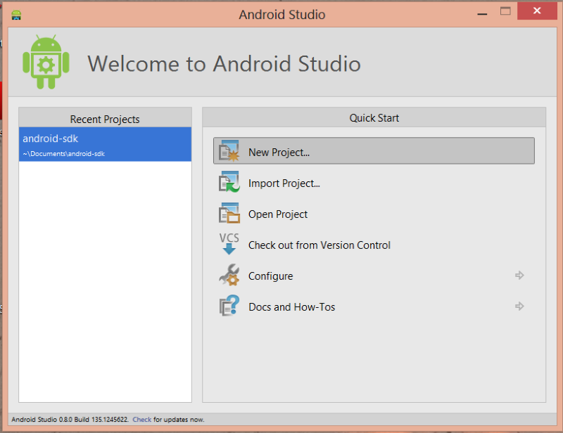
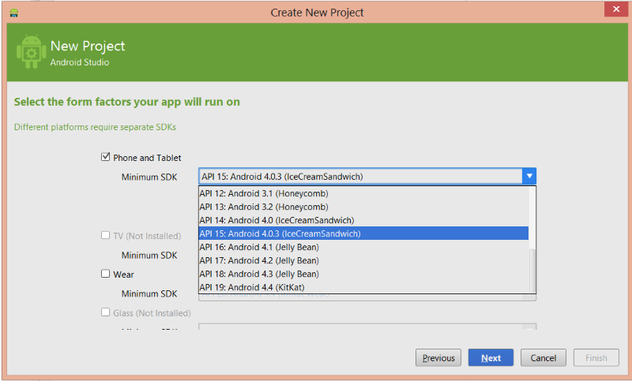
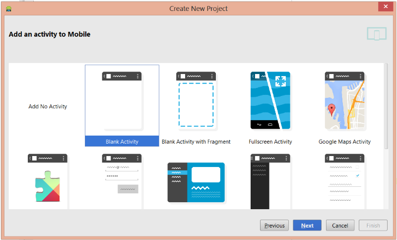
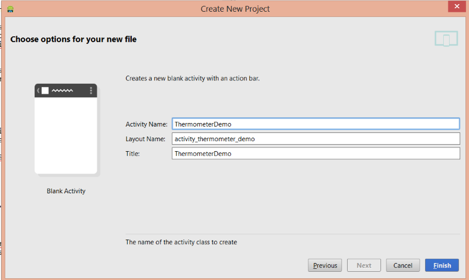
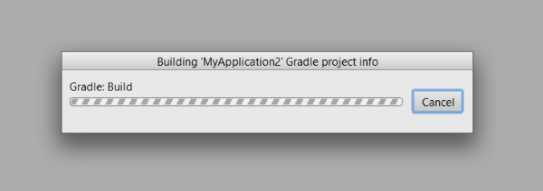
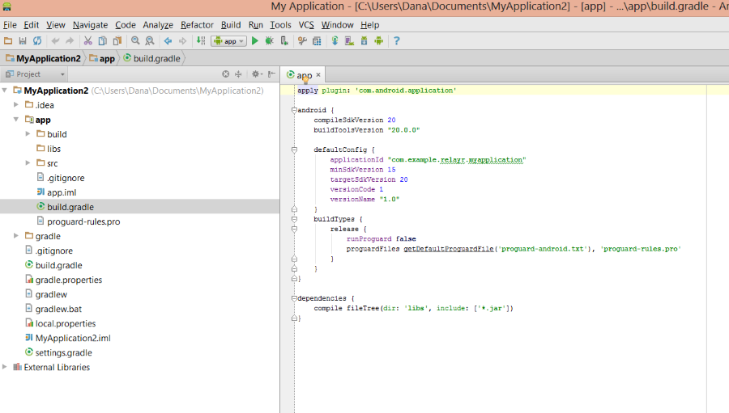

# Setting up your Environment

Here are a few preliminary steps you would need to follow in order to get your development environment all ready for building you first app. 

### Download [Android Studio](https://developer.android.com/sdk/installing/studio.html)

----------

### Create an Android Project on Android Studio 

#### Give your project a name

#### Set the minimum supported version
The minimum supported version for the relayr Android project is 15 (4.0.3).

#### Select an Android activity

#### Choose your activity options

#### Click "Finish" to start the building process of your initial project

 

----------

   
###  Enabling the relayr Android SDK 

We have made the relayr Android SDK available on Maven as to simplify the inclusion process.

#### Open the *build.gradle* file inside your app folder (*app/build.gradle*)

#### Add the following to your dependencies:
	    
	    dependencies {
	        compile 'io.relayr:android-sdk:0.0.5'
	    }

#### Click to save the file or compile to ensure that everything is in order.

----------

#### Now that you are done setting up your environment, click [here](https://developer.relayr.io/documents/Android/GettingStarted) to go back to the Getting Started page.