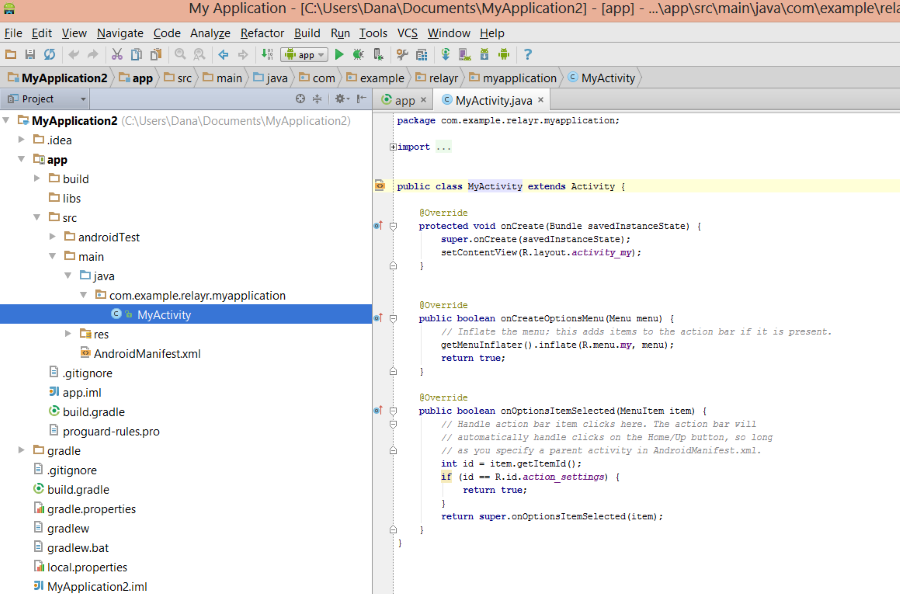
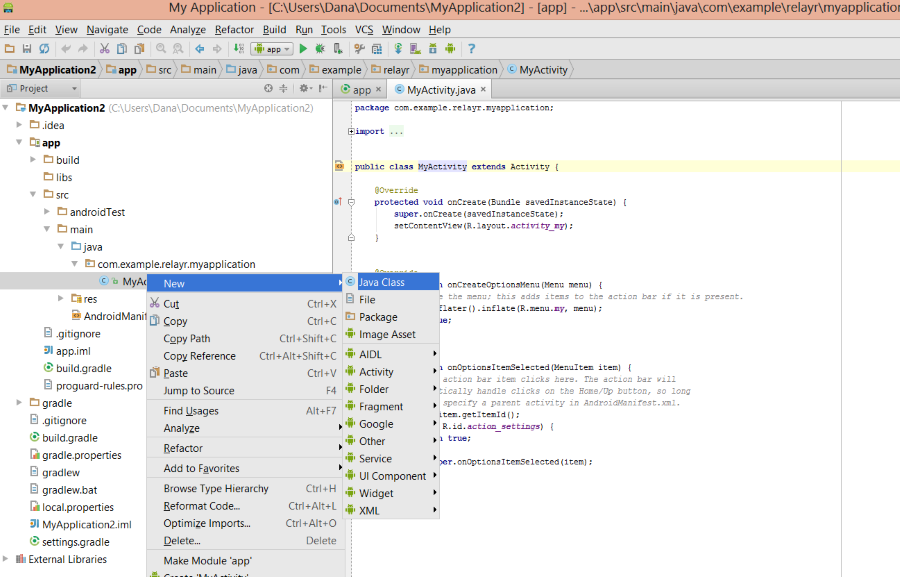

# Getting Started

Here are the first steps to get you started in the relayr world. Follow them and you'd be building your first app in no time!

### Create a [relayr User](https://api.relayr.io/oauth2/auth?client_id=D-aSJGtuUeQPwIgos1Xt_xAhXzo9RpiR&redirect_uri=https://developer.relayr.io/dashboard/scrape&response_type=token&scope=access-own-user-info+configure-devices) in case you don't have one already

----------

### Set up your environment for your first relayr Android project - See instructions [here](https://developer.relayr.io/documents/Android/AndroidEnvironment)

----------

###  Create a relayr app on the [app page](https://developer.relayr.io/dashboard/apps/myApps). 

### Download the *Key file* at the end of the app creation process 
The key file is used by the SDK to tell the relayr Platform which app you are.

### Place the application key (*relayrsdk.properties*) inside *src/main/assets* 

If the *assets* folder does not exist, create it in the above path.

----------
### Create your Application Java class

Open *app/src/main/java*. You should find your created activity as shown below:

Right click the activity name, select 'New' from the drop down list and then select Java class:

you will be asked to give your new class a Name. 

Now, you want your Application to be a type of *android.app.Application*, otherwise Android won't be able to recognize it.
To achieve this you will need to **extend** the android Application class. Extending means
including everything which is in the Android Application class, and whatever you add to it.

	public class MyApplication extends Application [...]

Start Typing 'extends' after the class name, Android Studio will suggest
'autcompleting' this for you, which makes it faster. Start typing 'Application' and again it will suggest app.android.Application. Android also adds an **import** statement at the top, which indicates to 'java' which 'Application' you mean.

----------

### Add an onCreate Handler

As we are interested in our app being launched, the next step will be to create a handler for the 'create' event. The create event is the one fired when the app is launched. We therefore create an *onCreate* handler. You can choose events already defined in the Application class by choosing 'Override methods' from the Code menu, or just copy and paste the following:

    @Override
    public void onCreate() {
        super.onCreate();
    }

This method doesn't do anything yet. We will add a single line
which sets up the relayr SDK so we can use it:

    @Override
    public void onCreate() {
        super.onCreate();
        RelayrSdk.init(this);
    }

At this point, the class doesn't recognize the RelayrSdk so it marks it
in red, as an error. you will need to add another import statement, so that Studio can
find the relevant class. The easiest way is to select the word, Studio suggests the
import statement which you can select by typing opt+Enter.  

----------

	    
###  Include the app in the Android Manifest and add Internet permissions

Inside *src/main/AndroidManifest.xml*: Reference your Application by adding the **android:name** to the application element: 
    
    
    <application
        android:allowBackup="true"
        android:icon="@drawable/ic_launcher"
        android:label="@string/app_name"
        android:theme="@style/AppTheme"
        android:name=".MyApplication">

And add Internet permissions as shown below:

	<uses-permission android:name="android.permission.INTERNET" />

----------

    
###  Create a Login Sequence

In order for your app to allow users to see their devices, you would need to add a login sequence. Click [here](https://developer.relayr.io/documents/Android/LoginSequence) to learn more about how to create a *Login* sequence.   

    
----------

You are all set now to start building your relayr Android app! Have a look at our <a href= "https://developer.relayr.io/rendered-doc/javadoc/index.html" target="_blank">SDK reference</a> to learn more about our SDK.

If you would like to learn more about what the Android SDK is capable of, have a look at our <strong><a href="https://github.com/relayr/android-demo-apps/tree/master/thermometer" target="_blank">Thermometer Sample Project </a></strong>
As well as our <strong><a href="https://developer.relayr.io/documents/Android/DeviceChannel">Subscribing to a Device Channel Example</a></strong>	

