# Building your First relayr iOS/OSX App - A Step by Step Tutorial

Always wanted to start developing for iOS or OSX and never really knew how to go about it? What if we told you that you don't really have to be an iOS or an OSX developer in order to start building apps for relayr? 

Have a look at this easy to use step by step thermometer app tutorial which will walk you through building your first iOS/OSX relayr app. We've broken it down into 5 steps, so you too could get an idea of what iOS/OSX app development is all about.

Ready to rumble? Let's Go!

<h2 class="collapseHeader">Step 1: Setting up your XCode Project</h2>

<h3>Installing <a href="https://itunes.apple.com/us/app/xcode/id497799835?ls=1&amp;mt=12">XCode</a></h3>

Click the App Store icon to install XCode via the Apple app store. 

<h3>Creating a Single-View Project on XCode</h3>
<h4>Open XCode and navigate to <em>File &gt; New &gt; Project</em></h4>

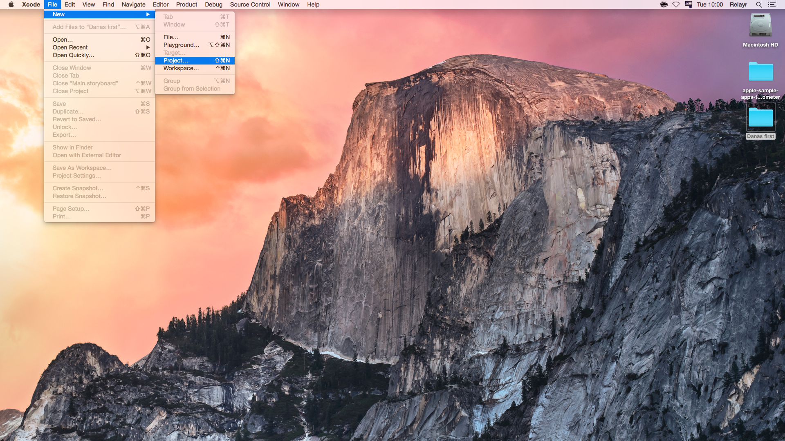

<h4>Select the <em>Single View Application</em> option on the next screen and click next</h4>

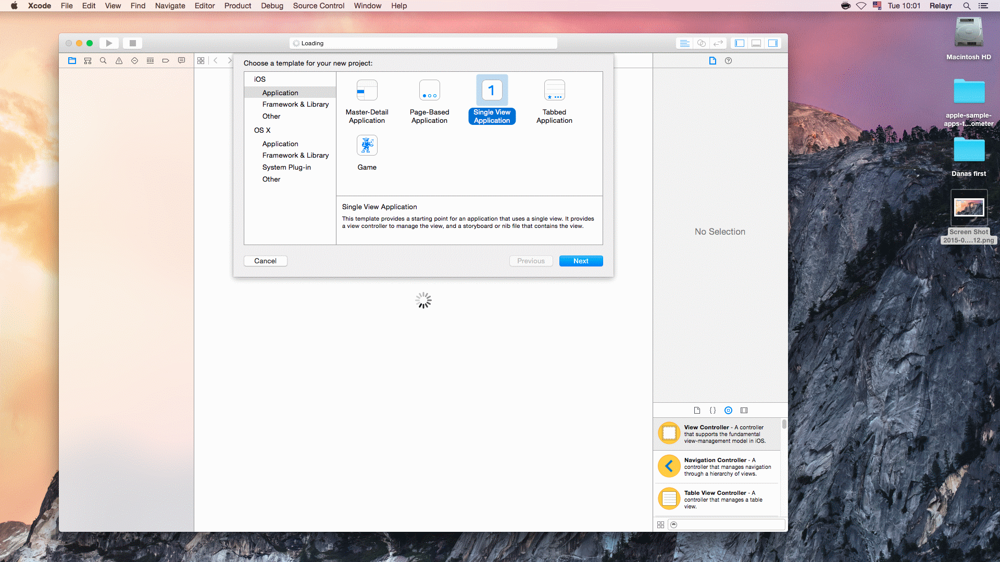

<h4>Give your project a name and choose your organization identifier</h4>

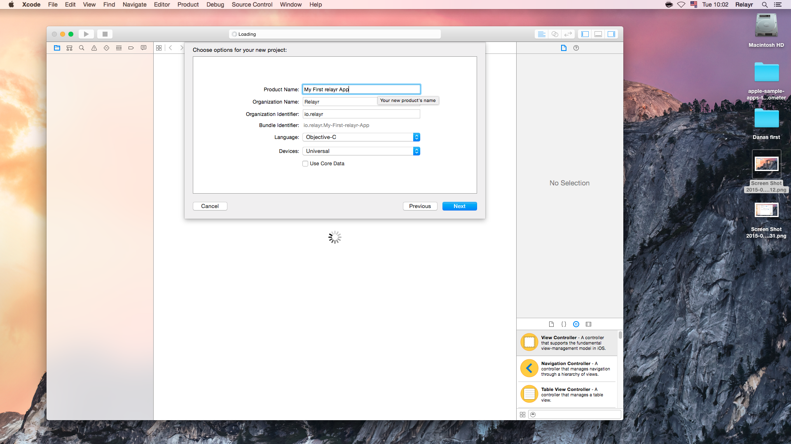

In the <em>Devices</em> field, you could either leave the setting on the default &quot;Universal&quot; or select a device group for which you would like to develop (iPhone or iPad)

<h4>Save the project</h4>

In this screen you will be prompted to determine where to save your project. In the example below we've simply selected &quot;Desktop&quot;.

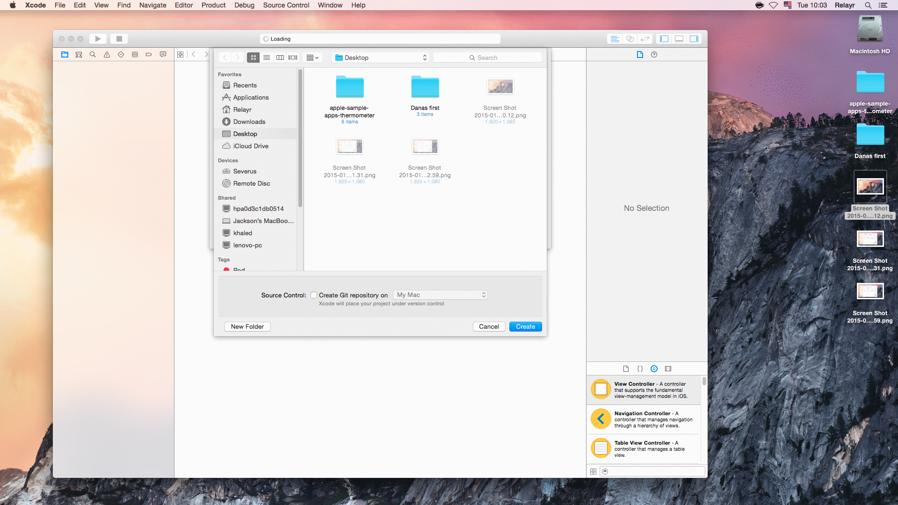

<h4>View your project summary</h4>

XCode will build the project and will display the following summary at the end of the build process 

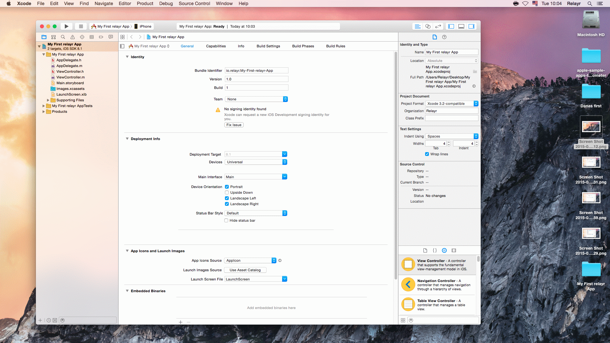

<strong>NOTE</strong>: In order to run your project on an external device you may need to request an <a href="https://developer.apple.com/developer-id/">Apple Developer ID</a>. However, running it on a simulator could be done without this ID.

You are all set to start coding! Move on to the next step.

<h2 class="collapseHeader">Step 2: Adding the relayr Framework and Header</h2>

This step details how to obtain the relayr SDK and include it in your project.

<h3>Prerequisites</h3>

In order to use the SDK the following is required: 

<ul>
<li>For iOS applications: Xcode 6+ and iOS 8 and above (since the framework is released in the <em>Cocoa Touch Framework</em> form).</li>
<li>For OSX applications: Xcode 5+ and OSX 10.9 and above.</li>
</ul>

The <em>RelayrSDK</em> project generates a product called <code>Relayr.framework</code> which, depending on your use purpose, can be run on a mac or on an iOS device.

<h3>Obtaining the relayr Framework</h3>

You can obtain the framework in one of the following manners:

A. <strong>Download</strong> the <code>.framework</code> file for the platform you are developing for from the latest <a href="https://github.com/relayr/apple-sdk/releases">Github release page</a>

<strong>NOTE</strong>: The page includes two versions of the compiled SDK - one for applications developed for iOS and for device simulators and another for apps developed for OSX. Make sure to download the version suited for your type of development.

<em>or</em> 

B. <strong>Generate</strong> the <code>.framework</code> file from the source code.

To generate the framework follow the steps below:

<ol>
<li>Download the repository from <a href="https://github.com/relayr/apple-sdk">GitHub</a></li>
<li>Open the <code>Relayr.workspace</code> in Xcode.</li>
<li>Select a specific target from the workspace's targets. If you are developing for iOS, select <code>Relayr_iOS</code>; if you are developing for the Mac, select <code>Relayr_OSX</code>.</li>
<li>Select your target platform. For Mac, there is only one choice (Mac); for iOS, you can generate a framework for either the simulator or for an iOS physical device.</li>
<li>Edit the schema to select the type of build of your choice: Debug, Release, Distribution.</li>
<li>Select <code>Product &gt; Build</code> from the Xcode top menu (or press ⌘+B).</li>
<li>Grab your <code>.framework</code> file from the created <code>/bin</code> folder on the workspace directory.</li>
</ol>

<em>or</em>

C. <strong>Make</strong> the <code>RelayrSDK</code> project a dependency of your build chain.

This manner allows for maximum customization, however, you do need to know your way around XCode to use it. The relayr SDK will build its product in a separate folder. Therefore, you need not only to add the framework as a target dependency, but also change your build settings to search for the framework on the <code>Build Settings</code> tab of your project.

<h3>Including the Framework in your Project</h3>

To use the framework, just drag and drop the <code>.framework</code> file onto your project and make sure that the framework appears both under <em>Embedded Binaries</em> and under <em>Linked Frameworks and Libraries</em>;

<strong>NOTE</strong>: The default action when dragging and dropping a framework onto a project is a simple <em>linking</em> of the framework, rather than <em>adding</em> it to the final binary image. In this case, you will need to remove the framework from <em>Linked Frameworks and Libraries</em> and add it to the <em>Embedded Binaries</em> (which will automatically link the framework as well).

<h3>Referencing the Framework in your Code</h3>

Now that we've obtained the the framework and included it in our project we need to add a reference to it from the code. 

<strong>Open</strong> your <em>ViewController.m</em> file, located under the your main app tree. In our case the path is <em>My First relayr App &gt; My First relayr App &gt; ViewController.m</em>

<strong>Add</strong> the following import statement

<pre><code>#import &lt;Relayr/Relayr.h&gt;
</code></pre>

and <strong>delete</strong> the following code, as we will not be using it: 

<pre><code>(void)didReceiveMemoryWarning {
[super didReceiveMemoryWarning];
// Dispose of any resources that can be recreated.
</code></pre>

Your ViewControler.m file should now look like this: 

<pre><code>#import &quot;ViewController.h&quot;      // Header
#import &lt;Relayr/Relayr.h&gt;       // Relayr.framework

@interface ViewController ()
@end

@implementation ViewController

#pragma mark - Public API

- (void)viewDidLoad
{
[super viewDidLoad];
}

@end
</code></pre>

To see the full commit for this stage please have a look at <a href="https://github.com/relayr/apple-sample-apps/commit/57efec5313a1ef4178f591f82dd9cac7dc3c3997">Step 2 of the Apple Sample Thermometer App</a>

You are all set to move to the next step!

<h2 class="collapseHeader">Step 3: Creating a relayr App and Signing in a User</h2>

In this step we will walk you through creating an app on the relayr Developer Dashboard and obtaining your app key

<h3>Creating a relayr User</h3>

 Access the relayr Developer Dashboard and create a <a href="https://api.relayr.io/oauth2/auth?client_id=D-aSJGtuUeQPwIgos1Xt_xAhXzo9RpiR&amp;redirect_uri=https://developer.relayr.io/dashboard/scrape&amp;response_type=token&amp;scope=access-own-user-info+configure-devices">relayr User</a> in case you don't have one already

<h3>Creating a relayr app</h3>

 access the <a href="https://developer.relayr.io/dashboard/apps/myApps">app page</a> and create a relayr app by clicking New API key

<h3>Referencing your App in your Code</h3>

<strong>Download</strong> the <em>Key file</em> at the end of the app creation process
The key is used by the SDK to tell the relayr Platform which app you are.

<strong>Copy</strong> your app credentials into the code:
Open the Key file and copy the values into the following parameters:

<pre><code>#define RelayrAppID         @&quot;YOUR APP ID&quot;
#define RelayrAppSecret     @&quot;YOUR APP SECRET&quot;
#define RelayrRedirectURI   @&quot;YOUR REDIRECT RUI&quot;
</code></pre>

The parameters should be placed right after the Import statements.

<h3>Retrieving the App</h3>

In your <em>ViewController.m</em> file add the following in order to retrieve the app with the above credentials:

<pre><code>[RelayrApp appWithID:RelayrAppID OAuthClientSecret:RelayrAppSecret redirectURI:RelayrRedirectURI completion:^(NSError* error, RelayrApp* app) {
    if (error) { return; }
</code></pre>

These lines should be added into the <code>viewDidLoad</code> right under the <code>[super viewDidLoad];</code> line.
The logic to be followed in case of an error will be defined at a later stage.

<h3>Signing a User into the App</h3>

Following the retrieval of an app we need to enable a user to log in as to allow them to use the app. 
We'd need to add the following right after the former lines: 

<pre><code>    [app signInUser:^(NSError* error, RelayrUser* user) {
        if (error) { return; }

        NSLog(@&quot;User was signed in correctly!&quot;);
    }];
}];
</code></pre>

In this instance too, the logic behind error handling will be defined at a later stage.

To see the full commit for this step please have a look at <a href="https://github.com/relayr/apple-sample-apps/commit/a47dd54e27d14cc53504acc434fb0c8d1951dc89">Step 3 of the Apple Sample Thermometer App</a>

<h2 class="collapseHeader">Step 4: Retrieving a Temperature Sensor</h2>

In this step we will select the temperature sensor from the devices associated with the user retrieved in the former step and prepare it for data display which will be described in step 5.

<h3>Adding an App Pointer</h3>

<strong>We'll start</strong> by defining a pointer for the app retrieved in the former step, in order to prevent it from being deleted. We use the following line and insert it in  <code>- (void)viewDidLoad</code>, in the <em>ViewController.m</em> file 

<pre><code>static RelayrApp* storedApp;
</code></pre>

<h3>Adding Error Handing Strings</h3>

<strong>Next</strong>, we'll add the functionality behind error handling to the specific places where the app may fail:

A. For the process of <em>retrieving the app</em>:

<pre><code>[RelayrApp appWithID:RelayrAppID OAuthClientSecret:RelayrAppSecret redirectURI:RelayrRedirectURI completion:^(NSError* error, RelayrApp* app) {
    if (error) { return NSLog(@&quot;There was an error retrieving the RelayrApp.&quot;); }
    storedApp = app;
</code></pre>

In this case we also add the <code>storedApp = app;</code> line to make sure that in the event of a successful retrieval the app is stored for later usage.

B. For the process of <em>retrieving the user</em>: 

<pre><code>    [app signInUser:^(NSError* error, RelayrUser* user) {
        if (error) { return NSLog(@&quot;There was an error signing in the user.&quot;); }
</code></pre>

The two error handling messages will be written to the console log - they will not be shown to the app user.

<h3>Retrieving a Device</h3>

We'll move on to defining the logic for retrieving, first the <a href="https://developer.relayr.io/documents/relayrAPI/Introduction">transmitters</a> associated with the user and then a Temperature sensor device. By transmitter in this case we refer to the WunderBar's <a href="https://developer.relayr.io/documents/WunderBar/MM">master module</a>.

It's a slightly larger block of code but we've added comments to explain what we've done. See you on the other side

<pre><code>        // First, we retrieve the transmitters associated with the user 
        // In case of an error a message is written to the console.
        [user queryCloudForIoTs:^(NSError* error) {
            if (error) { return NSLog(@&quot;There was an error retrieving user transmitters.&quot;); }

            // To simplify matters, we assume that the user only has one transmitter (one WunderBar) associated.
            // In case of an error a message is written to the console.
            RelayrTransmitter* transmitter = user.transmitters.anyObject;
            if (!transmitter) { return NSLog(@&quot;The user has no wunderbars associated.&quot;); }

            // The relayr cloud mantains a list of &quot;meanings&quot; specifying the capabilities of devices.
            // In this case we are interested in &quot;temperature&quot;.
            // In case a temperature sensor is not found, a message is written to the console.
            RelayrDevice* device = [transmitter devicesWithInputMeaning:@&quot;temperature&quot;].anyObject;
            if (!device) { return NSLog(@&quot;The user hasn't onboarded a temperature sensor.&quot;); }
        }];
</code></pre>

So now that we've retrieved the temperature sensor we can move on to the last step, which is displaying the data.

To see the full commit for this step please have a look at <a href="https://github.com/relayr/apple-sample-apps/commit/b5c37eeaf4208224915830c8b74100d6e3798c0e">Step 4 of the Apple Sample Thermometer App</a>

<h2 class="collapseHeader">Step 5: Subscribing to Data and Displaying it</h2>

In this last and final step of building the application, we'll add the logic behind displaying the data and create the UI for displaying it on the screen.

<h3>Adding A Value Parameter</h3>

In the <em>ViewController.m</em> file, add the <code>currentTempLabel</code> parameter which will later hold the reading value of the temperature sensor. This is how you could declare it:

<pre><code>@property (weak,nonatomic) IBOutlet UILabel* currentTempLabel;
</code></pre>

Well... since we have one sensor which measures both temperature <em>and</em> humidity, we thought, why not have the humidity value also display on the screen? To accommodate that we'll add a second variable to hold the humidity value:

<pre><code>@property (weak,nonatomic) IBOutlet UILabel* currentHumidLabel;
</code></pre>

<h3>Displaying Data - Logic</h3>

Next, we'll add the logic behind the data retrieval: 

<pre><code>[device subscribeToAllInputsWithBlock:^(RelayrDevice* device, RelayrInput* input, BOOL* unsubscribe) {
    if ([input.meaning isEqualToString:@&quot;temperature&quot;])
    {
        _currentTempLabel.text = [NSString stringWithFormat:@&quot;%@ ºC&quot;, input.value];
    }
    else if ([input.meaning isEqualToString:@&quot;humidity&quot;])
    {
        _currentHumidLabel.text = [NSString stringWithFormat:@&quot;%@ %%&quot;, input.value];
    }

} error:^(NSError* error) {
    NSLog(@&quot;%@&quot;, error.localizedDescription);
}]; 
</code></pre>

We first subscribe to all type of readings the sensor (device) is capable of sending, we then perform a check to see which type the value it is and assign it into the respective parameter defined at the beginning of this step.

<h3>Displaying Data - UI</h3>

XCode allows us to use an actual story board in order to define the UI of the application we build. fields can easily be created and anchored to the logic responsible for their functionality.

<strong>Open</strong> the <em>Main.storyboard</em> file,
located in the main tree of your app. In our case the path is <em>My First relayr App &gt; My First relayr App &gt; Main.storyboard</em>.

<h4>Adding &quot;Temperature&quot; and &quot;Humidity&quot; text labels</h4>

In the right hand bottom text field <strong>start typing Label</strong> - XCode will automatically complete the text and display a Label entity:

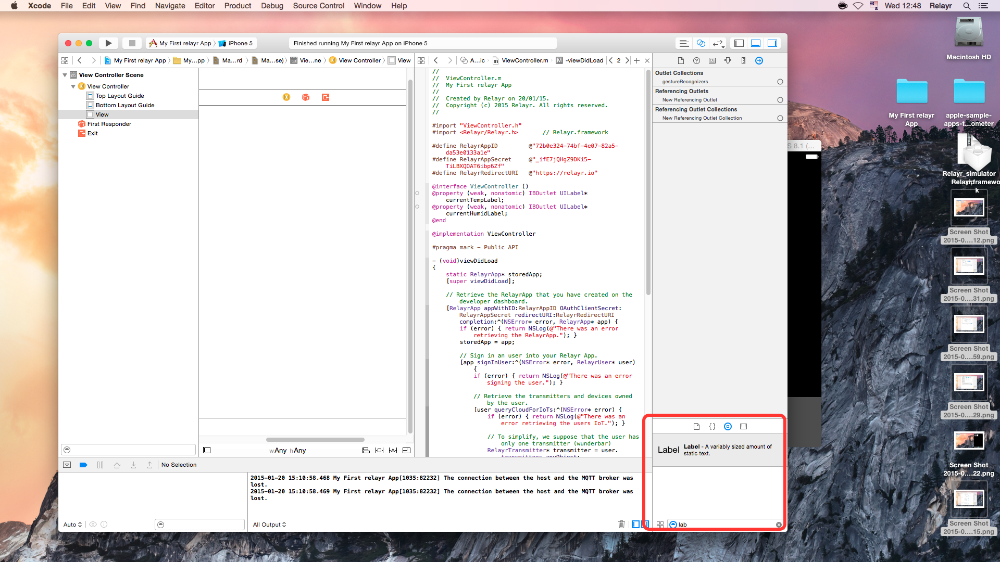

<strong>Drag</strong> the label item onto the viewer and drop it at the location where you would like it to appear. You can drag and drop as many labels as you want 

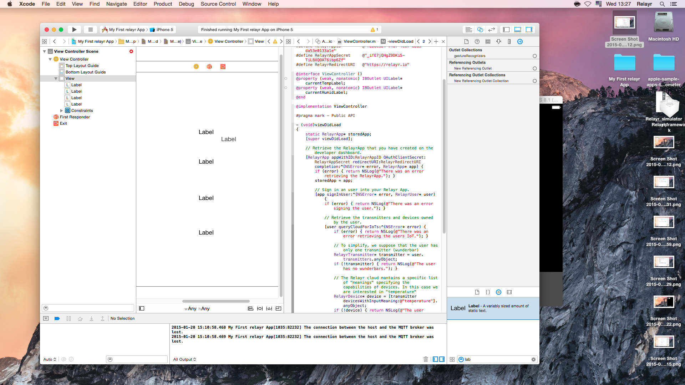

<strong>Change</strong> the Names accordingly (simply double click to change the text)

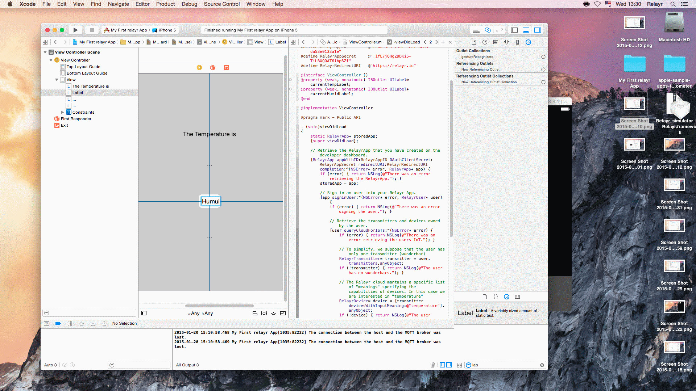

<strong>A tip for positioning</strong>: In order to ensure that your labels are centralized both horizontally and vertically, place the mouse on the label name, click Ctrl and dag the mouse aside, the following menu will appear: 

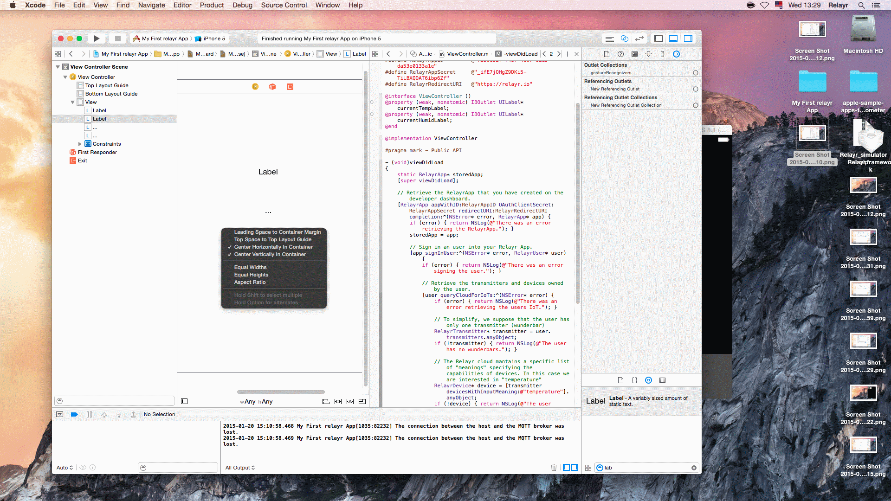

Make sure the two options <em>Center Horizontally in Container</em> and <em>Center Vertically in Container</em> are ticked. 

<h4>Adding placeholder labels for the measurement values</h4>

Apart from the &quot;Humidity&quot; and &quot;Temperature&quot; labels, we need two additional labels, as placeholders for the values to be displayed. The two labels will be associated with the code and will reflect the change in <code>currentTempLabel</code> and <code>currentHumidLabel</code>. 

We've decided to place &quot;...&quot; as the name of these labels. This value will of course be displayed as long as no data is received. Once data is received the label will change reflecting the change in the values being sent.

<h4>Associating the labels with the code</h4>

Adding the two placeholders is not enough. We need to tell our application that these labels should correspond to specific variables in the code and reflect the change in these variables. 

XCode allows us to easily do that. Simply hold the cmd key and physically link between the defined parameter and the placeholder label:

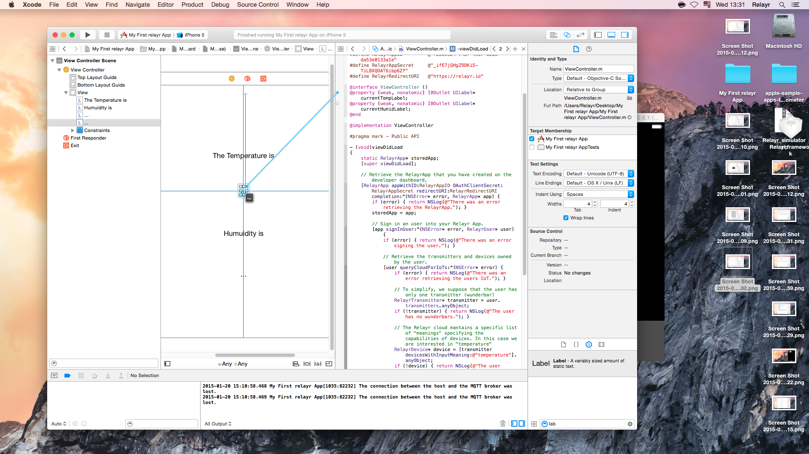

To see the full commit for this step please have a look at <a href="https://github.com/relayr/apple-sample-apps/commit/29f864001c25842568e1d61fbe6d83f6ea31304d">Step 5 of the Apple Sample Thermometer App</a>

You are done! Congratulations! Now all that's left to do is to run the application on your phone, your mac or on the simulator. We'll show you how to do just that, in the next step.

<h2 class="collapseHeader">Step 6: Running the App</h2>

Your app is capable of running on a number of Apple devices. This depends on the version of the <code>Relayr.framework</code> file you've chosen to integrate in your project.
If you have chosen to include the iOS version of the framework, you would be able to run it on iOS devices as well as on the XCode simulator.

<h3>Selecting the Target Device</h3>

On the left hand top menu select the device for which you would like to compile the app and on which you would like to run it.

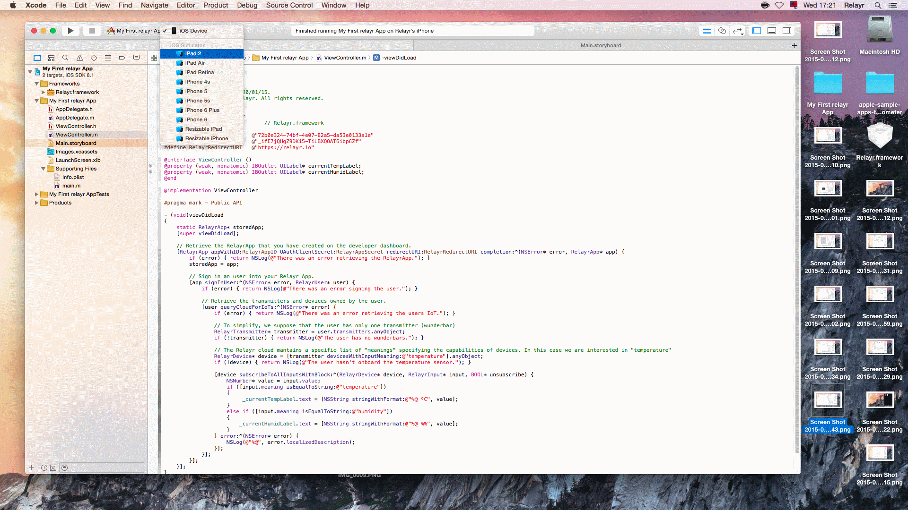

If you have a physical device connected it will appear at the top of the list. 

<h3>Running the App on the Device</h3>

To run the app simply click the Play icon at the top menu. The project will first initiate a build action and then launch the app on the target device of your selection. 

You will first be prompted with the relayr Login screen and once you log in, your app will show the values of the temperature and humidity you have connected

Make sure your WunderBar is connected and sending data, you can make sure data is sent by looking at your <a href="https://developer.relayr.io/dashboard/devices">devices page </a>on the Developer Dashboard. 

Congratulations! you've just completed your first relayr iOS App!

