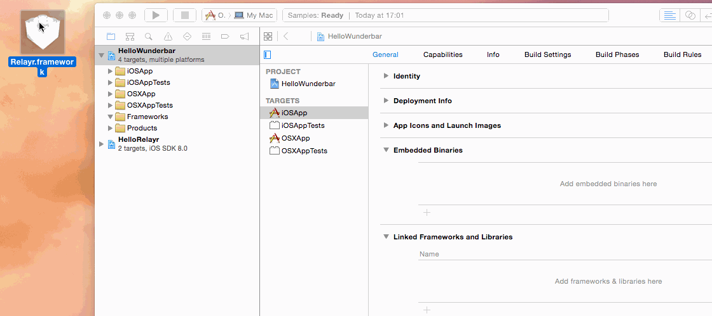

Introduction
------------
Welcome to the relayr Apple SDK.
The code introduced here, allows you to build the relayr Framework for iOS and MAC OS X. 

The *RelayrSDK* project generates a product called `Relayr.framework`, which, depending on your use purpose, can be run on a mac or on an iOS device.

Currently, the only dependency of the project is the PUBNUB library. 
If you are interested in building the framework *for iOS devices*, you will require **Xcode 6 and iOS 8**, since embedded frameworks have only been introduced in iOS 8 enable devices. 
For Mac applications, you can use Xcode 5.

You can view and download the complete project from our <a href="https://github.com/relayr/apple-sdk">apple-sdk repository on GitHub</a>.

## Getting Started - The Build process

There are currently two methods of including the `Relayr.framework` in your project:

#### Method 1: 
#### Getting the *.framework* file and dragging and dropping it into your project.

  * Download or generate the `Relayr.framework` file:
     
     
  
  * Drag and drop the file into your project and make sure that the framework appears both in *Embedded Binaries* and in *Linked Frameworks and Libraries*:
     
     

#### Method 2: 
#### Integrating the *RelayrSDK* project as a subproject of your workspace and then dragging and dropping the `Relayr.framework` product into the *Embedded Binaries* tab:

  

