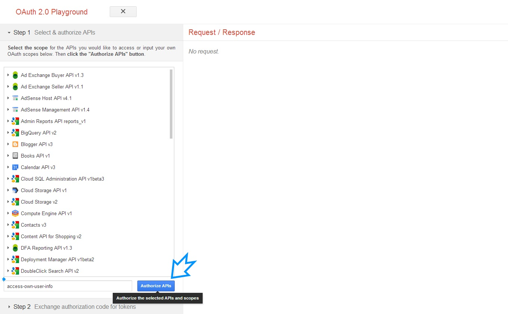
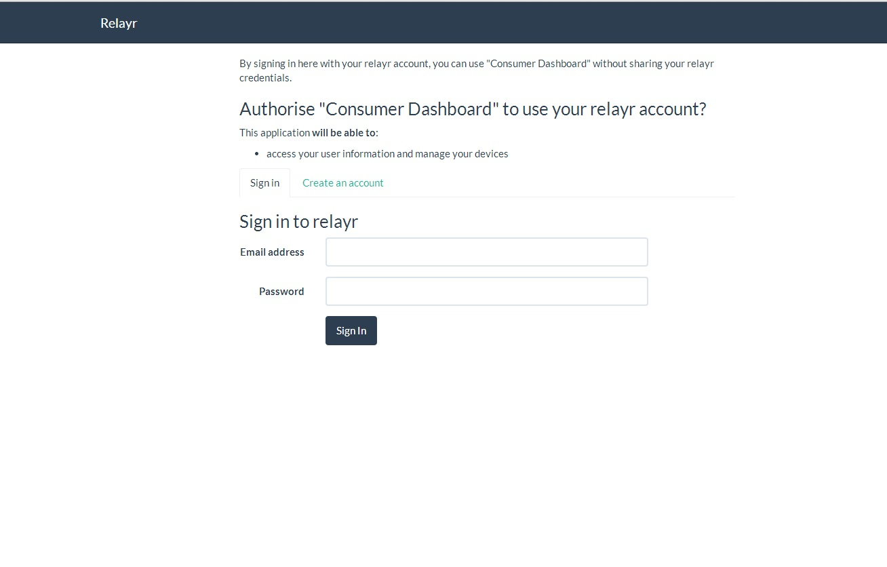
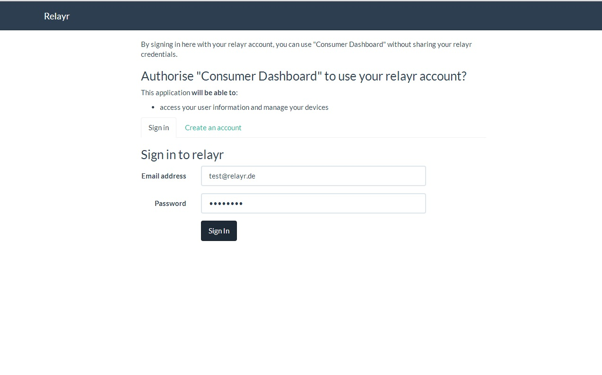

# OAuth Example

The example below provides a step by step interactive demonstration of the process which takes place when OAuth authorization tokens are issued on the relayr platform.

## The Access Code Scenario

#### 1. Access the <a href="http://goo.gl/FW1zFb" target="_blank"> OAuthPlayGround URL </a> 

#### 2. The context of the action is predefined:

#### 3. Click the settings menu on the top right corner.

#### 4. Click 'Authorize APIs'.

#### 5. You will be prompted to enter your relayr User credentials.

 

#### 6. Enter your credentials and click to sign in.

#### 7. Click Exchange Authorization code for tokens.

#### 8. The token is received as a JSON snippet in the response.

## The Implicit Grant Scenario

#### 1. Access the <a href="http://goo.gl/FW1zFb" target="_blank"> OAuthPlayGround URL </a> 

#### 2. The context of the action is predefined:

#### 3. Click the settings menu on the top right corner. Select the Client Side scenario from the drop down 

#### 4. Click 'Authorize APIs'.

#### 5. You will be prompted to enter your relayr User credentials.

 

#### 6. Enter your credentials and click to sign in. 

#### 7. The token is received as part of the URL and on the left hand side

