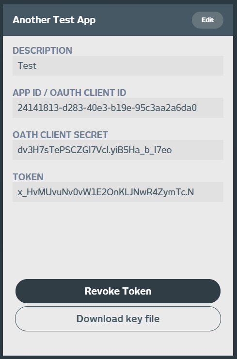

# Getting your relayr OAuth Token via the Developer Dashboard

Getting an OAuth Token for your app has never been easier. 

Simply access the [API Keys section](https://developer.relayr.io/dashboard/apps/myApps)

Navigate to the App you would like to generate a Token for and click "Generate Token":

To revoke the token generated simply click the "Revoke Token" button:

# Getting your relayr OAuth Token via the relayr API 

It is possible to issue your OAuth Application Token by issuing the following API call: 

	https://api.relayr.io/oauth2/appdev-token/{appId}

Where `appId` is the ID of your application. It may be obtained from the [Apps section](https://developer.relayr.io/dashboard/apps/myApps) in the Developer Dashboard.

Please note that this call is included in the API calls which may be imported into your [Postman collections](https://developer.relayr.io/documents/relayr%20API/ImportAPI)

