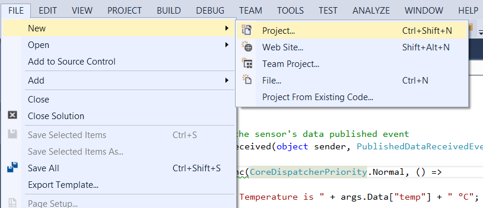
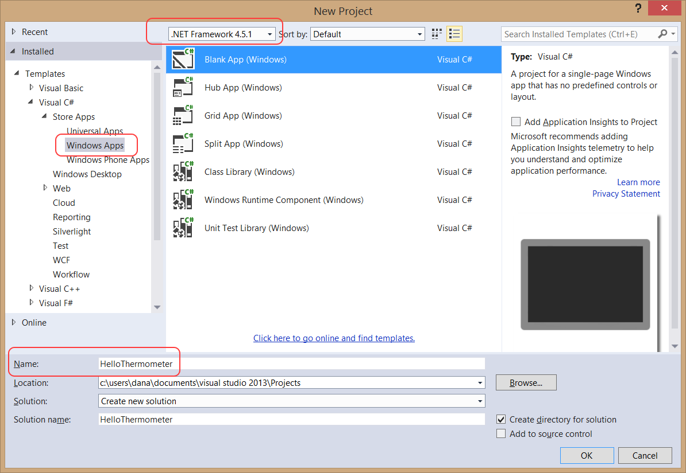
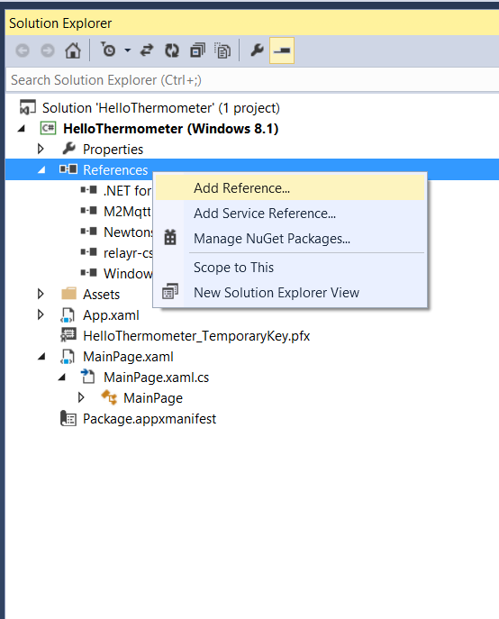
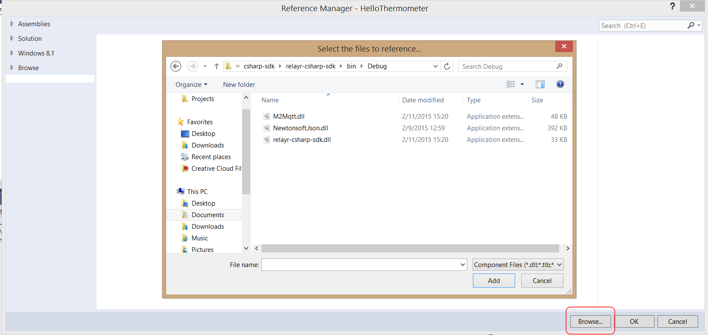
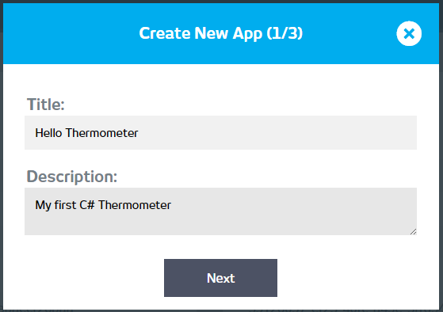
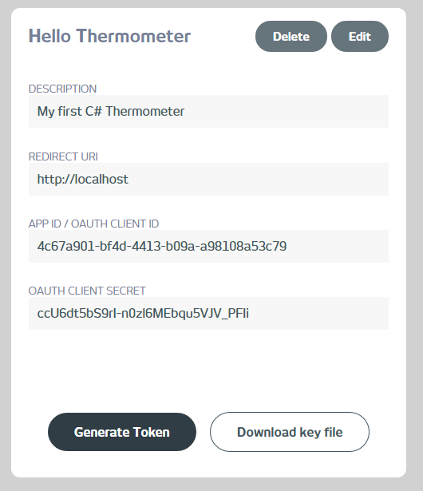
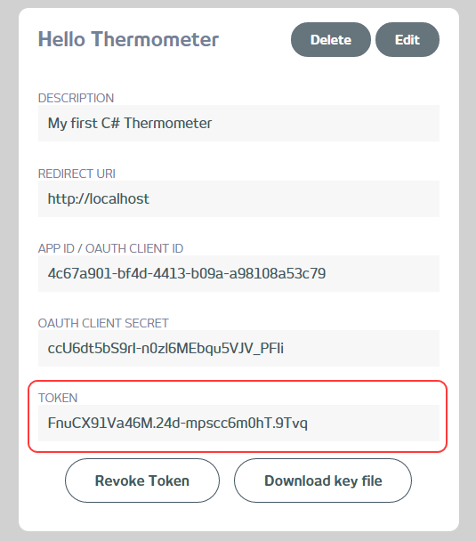
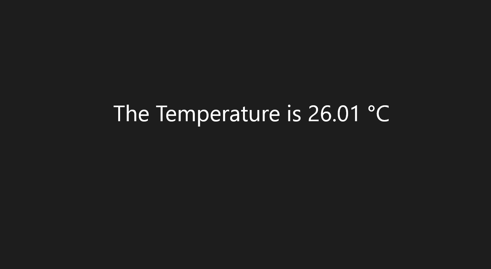

<h1>Building your first relayr C# App</h1>

You are most probably interested in getting your hands dirty with building apps for the relayr platform. It does not have to be iOs or Android... and most importantly, you don't even have to be a developer to do it! Curious? We're sure you are!

Have a look at this easy to implement step by step tutorial for building your first C# Thermometer app. Just follow the instructions and be on your way to a shiny new C# Thermometer, receiving data from your WunderBar temperature sensor, via the relayr cloud platform. 

<h2 class="collapseHeader">Step 1: Obtaining the C# SDK Repository</h2>

Clone the relayr C# SDK repository available <a href="https://github.com/relayr/csharp-sdk">here</a>

<h2 class="collapseHeader">Step 2: Installing Visual Studio</h2>

Visual Studio includes a free Express version which you could use without any issues in order to build your first app. Simply <a href="http://www.visualstudio.com/en-us/products/visual-studio-express-vs.aspx">Download</a> and install the package. 

<h2 class="collapseHeader">Step 3: Creating a Visual Studio Project</h2>

Once you've installed Visual Studio, you'd need to create a project which will include the code for your new app. Here are the steps to do just that

Start by creating the directory: in Visual Studio navigate to <em>New &gt; Project</em> 

We've chosen a Blank Windows App for the sake of this tutorial. You may choose a universal or a phone app, depending on the device you would like your app to work on. 

Make sure that the .NET version chosen is 4.5.1 and give your app a name

Visual Studio will build your initial project tree. You are all set. Let's move on to the next step!

<h2 class="collapseHeader">Step 4: Adding References to Packages Used in the Project</h2>

Cloning the SDK repository isn't enough. In order to use its methods in your project, you would need to add a reference to it.

In addition to the CSharp SDK you would need to reference two other Dll files in order to run the project. These are the <strong><em>M2MQTT.dll</em></strong> and the <strong><em>Newtonsoft.Json.dll</em></strong>

In your project tree navigate to <em>References</em> and right click to add a reference 

Click the <strong>Browse</strong> button and browse to the location where you initially cloned the CSharp SDK

All three Dlls are under the <em>/bin/Debug</em> folder. 

Select all three and click OK to add them as references. You are all done here - you can move on to the next step!

<h2 class="collapseHeader">Step 5: Creating an App on the Developer Dashboard and Obtaining your Token</h2>

One last step before we get down to some coding, is to create your app on the developer dashboard so the relayr platform which you will be communicating with knows who you are, which user you are under and whether you have the necessary authorization to receive the data from the temperature sensor.

Start by creating an app under the <a href="https://developer.relayr.io/dashboard/apps/myApps">API Keys</a> section. Simply click to add a new API Key.

Next, Click the &quot;Generate Token&quot; button on your newly created app

  

This is the token you would require in order to receive data from your WunderBar sensor.

<h2 class="collapseHeader">Step 6: Adding the Logic behind the App</h2>

Navigate to your <strong><em>MainPage.xaml.cs</em></strong> file, located in your under <em>{Your Main Project tree} &gt; MainPage.xaml</em>

All instruction in this step relate to this file. 

<h4>Initializing the Method</h4>

We'll start with creating a method to represent this logic sequence. We've called it <em>Thermometer();</em>

We'll initialize it using the following code: 

<pre><code>    public MainPage()
    {
        this.InitializeComponent();

        Thermometer();
    }
</code></pre>

The aforementioned code should be added right under the <em>MainPage</em> class. I.e. under this line:

<pre><code>public sealed partial class MainPage : Page
{
</code></pre>

<h4>Adding the Logic behind the Method</h4>

This will be the core of our code. Here is where we will define the functionality of subscription and data retrieval.

Here's the code - we've added some code comments to make it easier to understand:

<pre><code>public async void Thermometer()
{
    // Set the OAuth token
    Relayr.OauthToken = &quot;{ADD TOKEN GENERATED IN STEP 5}&quot;;

    // Get a list of transmitters and connect to the MQTT broker with the first one in the list
    List&lt;dynamic&gt; transmitters = await Relayr.GetTransmittersAsync();
    Transmitter transmitter = Relayr.ConnectToBroker(transmitters[0], &quot;{ID OF YOUR CHOICE}&quot;);

    // Get a list of devices associated with the transmitter, 
    // Subscribe to data from the first device on the list
    List&lt;dynamic&gt; devices = await transmitter.GetDevicesAsync();
    Device device = await transmitter.SubscribeToDeviceDataAsync(&quot;{ADD TEMPERATURE SENSOR ID}&quot;);
    device.PublishedDataReceived += device_PublishedDataReceived;

}
</code></pre>

We start by setting the token - the one generated in step 5.
We continue with getting a list of the transmitters registered under the user whose token has been entered. We select the first transmitter on the list.

In the last part of the code we subscribe to the temperature sensor defined under the transmitter. In order to simplify matters as much as possible, we are transferring the actual <em>sensorId</em> parameter to the subscription method. You can obtain your sensor ID by accessing your Devices page and clicking the settings icon of the device you are interested in

Guess what? you are almost done! the last thing that needs to be done is to facilitate the data received and display it. We'll show you how to do precisely that in the next step.

<h2 class="collapseHeader">Step 7: Displaying Data</h2>

This step will be divided in two. The first will be to facilitate a simple design for the data to be displayed and the second will be adding the logic behind the display. Let's get right to it!

<h4>Design</h4>

This section relates to the <strong><em>MainPage.xaml</em></strong> file, which determines the manner in which data will be displayed. 

We add a simple line of code to the <em><Grid></em> tag: 

<pre><code>&lt;Grid Background=&quot;{ThemeResource ApplicationPageBackgroundThemeBrush}&quot;&gt;
    &lt;TextBlock Name=&quot;output&quot; FontSize=&quot;72&quot; HorizontalAlignment=&quot;Center&quot; VerticalAlignment=&quot;Center&quot;&gt;No data yet&lt;/TextBlock&gt;
&lt;/Grid&gt;
</code></pre>

This will create a text box in which data will be displayed.

<h4>Logic</h4>

Now that we have our text block, all we need is to reference it back in our <strong><em>MainPage.xaml.cs</em></strong> file

So we add a handler to do just that:

<pre><code>// Create Handler for the the sensor's data published event
void device_PublishedDataReceived(object sender, PublishedDataReceivedEventArgs args)
{
    this.Dispatcher.RunAsync(CoreDispatcherPriority.Normal, () =&gt;
    {
        output.Text = &quot;The Temperature is &quot; + args.Data[&quot;temp&quot;] + &quot; °C&quot;;
    });
}
</code></pre>

<h2 class="collapseHeader">Step 8: Running the App</h2>

Before running the application make sure to compile the project. Simply navigate to <em>Build &gt; Build Solution</em> just to make sure all components work well together.

To run the app, simply click on the Play icon at the top menu and choose your target device: Local Machine, Simulator and Remote Machine.

That's it! 

