# CONNECTING THE BOSCH XDK TO THE RELAYR CLOUD

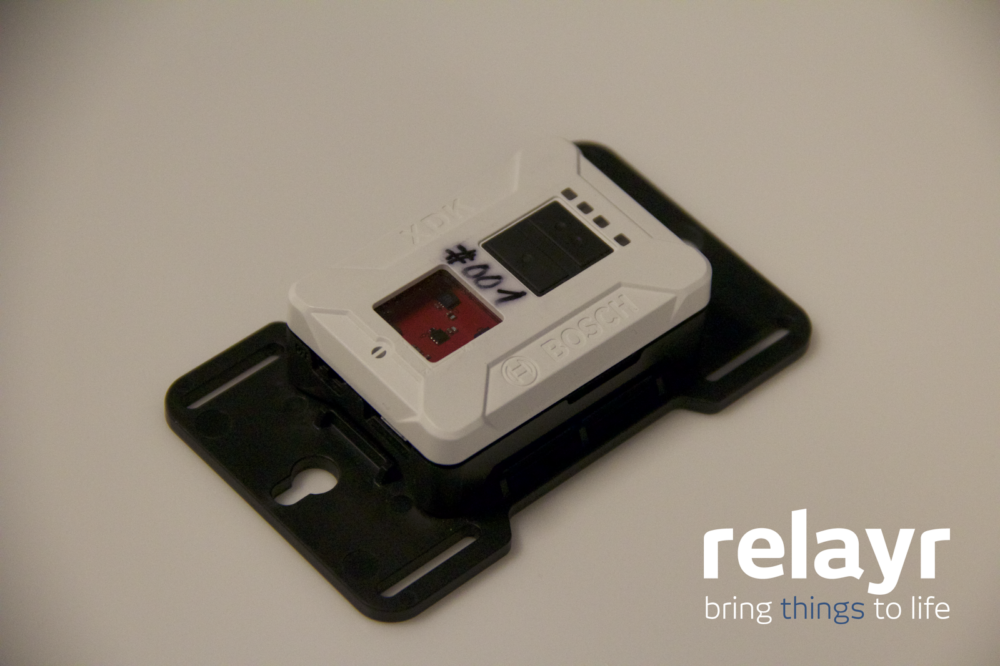

## Overview

The [Bosch XDK](http://xdk.bosch-connectivity.com/) is a prototyping platform from Bosch Connected Devices and Solutions for the Internet of Things - it is packed with state-of-the-art sensors and comes equipped with wireless connectivity via wifi and bluetooth, as well as a rechargeable Li-ion battery and microSD slot. Because it was developed to be essentially plug-and-play, it is easy to quickly create prototypes of systems to monitor environmental conditions such as temperature, humidity, ambient light, movement, magnetic fields, and sound. 

Currently these  devices are deployed in the Cisco Open Berlin Innovation Center to measure temperature, light, and noise levels, though other possibilities  include monitoring air quality in an office building, noise levels in a factory, or conditions leading to decay or corrosion in a warehouse such as humidity and temperature. When combined with the relayr dashboard for visualizing the sensor outputs, possibilities for connected solutions for your company are as great as your imagination!

## Creating your Bosch XDK on the relayr cloud

Start by downloading [GCC ARM Embedded](https://launchpad.net/gcc-arm-embedded/4.9/4.9-2015-q3-update), [Python 2](https://www.python.org/downloads/), the text editor of your choice (I used [Atom](https://atom.io/docs/v0.191.0/getting-started-installing-atom)) and the [XDK Workbench](http://xdk.bosch-connectivity.com/en/web/bcdscommunitygb/forum/-/category/using-xdk-downloads/10796-c). If you are working on a Mac or Linux, you will also need the [Segger JLink debugger](https://www.segger.com/jlink-software.html) and debugger board hardware (these are not needed if you are on Windows). 

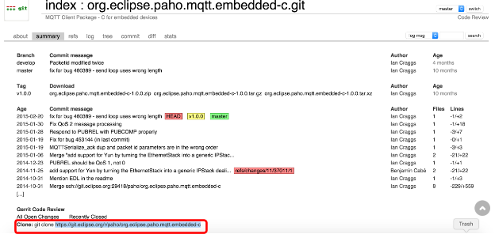

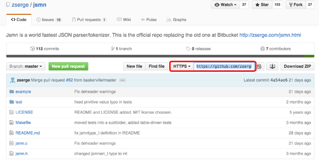

You should also clone the repos for [Paho MQTT](http://git.eclipse.org/c/paho/org.eclipse.paho.mqtt.embedded-c.git/) and [JSMN](https://github.com/zserge/jsmn), as shown above.

The Segger JLink utility and ARM GCC toolchain are needed to compile and flash XDK firmware on Mac and Linux (on Windows it is bundled with XDK Workbench and flashing is done via USB). Make sure that arm-none-eabi-gcc and JLinkExe binaries are accessible from command line. You might need to append paths to those tools to your shell PATH environment variable.

Now you can start setting up your device on the [relayr dashboard](https://developer.relayr.io/). Sign in or make an account, and go to “Your Devices”. Add a new device, and select “Create my Own Device”. 

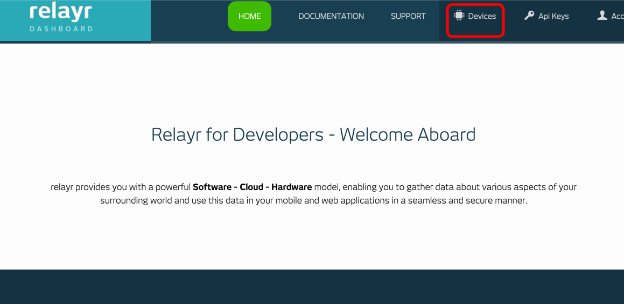

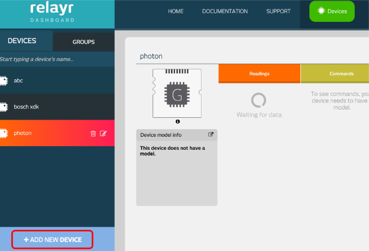

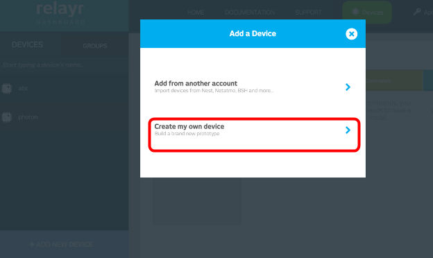

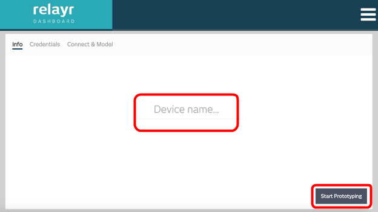

Give your device a name, and click  “Start Prototyping”.

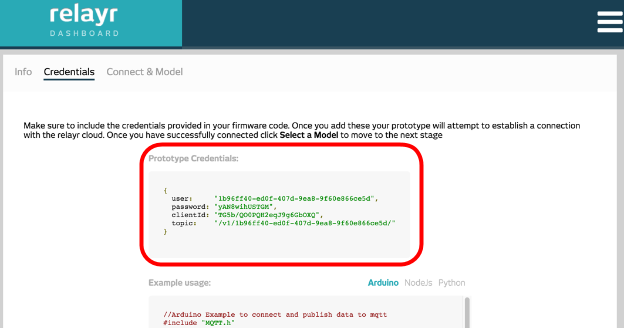

You will be taken to this screen - the important part here  is the “Prototype Credentials” box. Save the text here, because you will need these credentials later! 

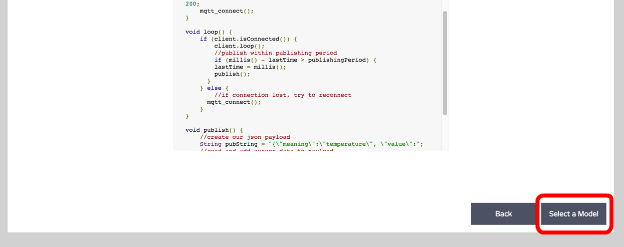

You can now scroll down below the “Example Usage” code and click “Select a Model”. 

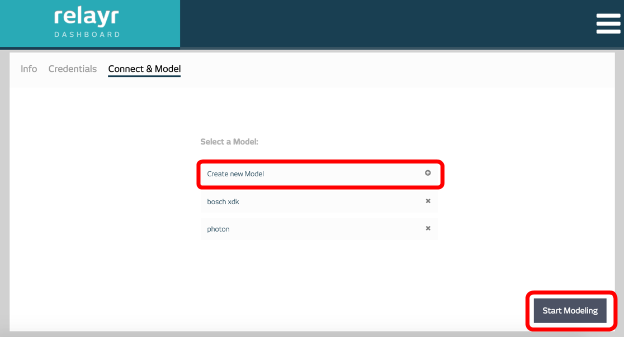

Select “Create new Model” and give it a name, then continue with “Start Modeling”.

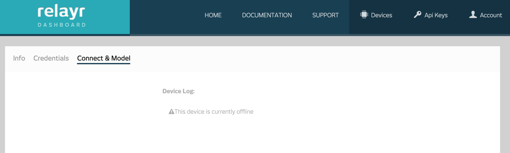

Click “Save”, then “Finish” in the relayr dashboard. 

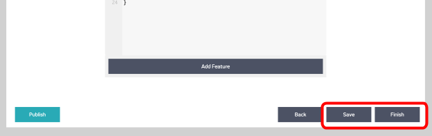

##Configuring your XDK

Next, head over to the [XDK on Relayr repo](https://github.com/relayr/xdk-mqtt) and clone it. Open it in your text editor, because we need to fill out a few specifics: 

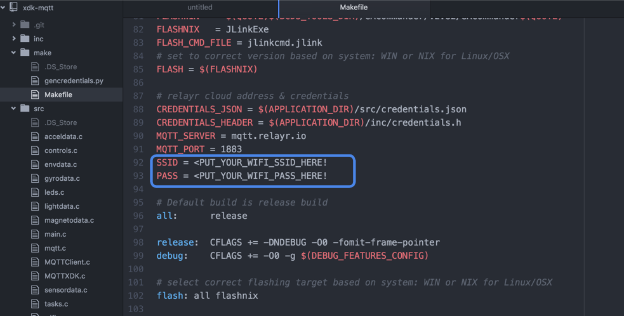

First, navigate to xdk-mqtt/make/Makefile, and scroll down to the entry asking for your wifi SSID and password, and specify the name and password of your wifi network, inside double-quotes.

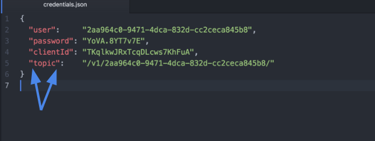

Now, head to xdk-mqtt/src/ and create a new file named “credentials.json”.  Paste in the “Prototype Credentials” you saved during device setup on the relayr dashboard. Add double-quotes around user, password, clientID, and topic, as shown above. 

Make sure all of your changes in the text editor are saved, then in the terminal, navigate to the /xdk-mqtt/make directory if you aren’t there already. 

Plug in your Bosch XDK hardware to your computer and make sure it is powered on. If yours isn’t, make sure the switch is on and both the cable for  flashing/programming/debugging (and if on a Linux or Mac, the JLink debugger) and the USB cable  are plugged in. 

Once everything is connected, execute ‘make’ and ‘make flash’  from the terminal, and you should see live readings from the sensors! 

Congratulations! You successfully connected your XDK to the relayr cloud! 

You can access the Device Activity log from this icon in the top right corner of your dashboard, which will also provide you with a command line to control your device.

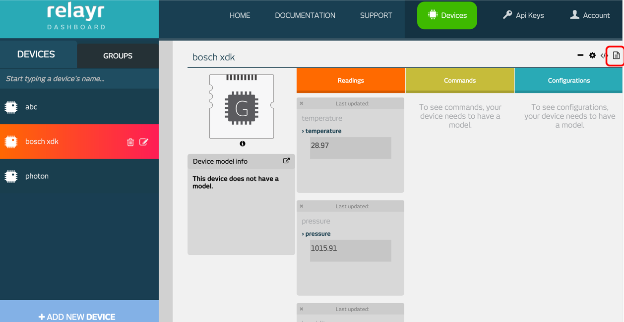

Try sending some commands to your XDK - for example you can turn the LEDs on and off by typing into the command line on the Dashboard.

	{"path" : "led", "command" : "<ledcolor>", "value" : "<0, 1, or 2>"}

* the options for ledcolor are : "red", "yellow", or "orange"
* the option for values are: 0 for off, 1 for on, and 2 to toggle

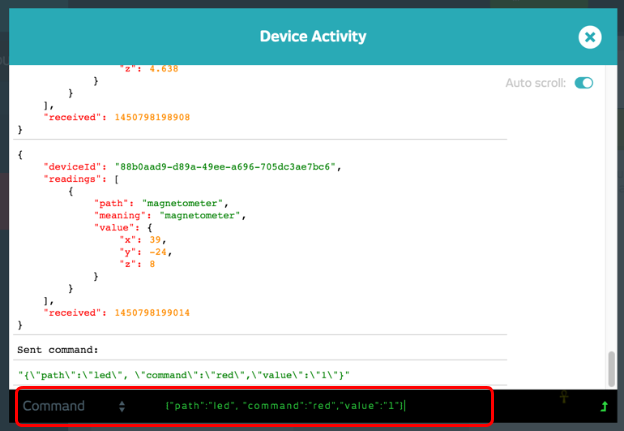

 Below is an example of what you can create using your new sensor data:

# BoschXDK Datatable in HTML
As an example project, we are setting up a simple html file which shows the raw Data the XDK is publishing. For that we create a new text file called boschxdk.html. For simplicity we are creating only one file which will hold both the Javascript and CSS parts of the page. Start with some basic headers:
	
	<!DOCTYPE html>
	<html lang="en-US">
	<title>Bosch XDK Data Table</title>

	<head>

##CSS
Add some CSS for centering, some loaders and the table. Feel free to add more and style differently
	
	   <!-- basic css -->
    

To load JS libraries, we are using [jquery](https://jquery.com) and [bootstrap](http://getbootstrap.com) for html handling and column configurations. Don't forget to import the [relayr Browser SDK](https://github.com/relayr/browser-sdk) as well!

	 	    <!-- some libraries -->
	    
	    
	    
	    <link rel="stylesheet" type="text/css" href="https://cdnjs.cloudflare.com/ajax/libs/twitter-bootstrap/4.0.0-alpha/css/bootstrap.css">
	</head>

##Body
The body is made of some text and a table in which we will add the incoming data.The first part is just the header and the loading circles:

	<body>
	    

	        

	            <h1>Bosch XDK Data Table</h1>
	        

	        

	            
this visualization is directly connected to the relayr cloud. It retreives all the data and shows it in the table

	        

	    

	    

	        

	            

	                

	                

	                

	            

	        

	    

Next, we define a readings `
` containing a table with dummy cells

	    

	        

	            

	                <table id="mytable" class="table table-striped table-bordered" cellspacing="0">
	                    <thead>
	                        <tr>
	                            <th>temperature</th>
	                            <th>pressure</th>
	                            <th>humidity</th>
	                            <th>acceleration</th>
	                            <th>gyro</th>
	                            <th>magnetometer</th>
	                        </tr>
	                    </thead>
	                    <tbody>
	                        <tr>
	                            <td>dummy1</td>
	                            <td>dummy2</td>
	                            <td>dummy3</td>
	                            <td>dummy4</td>
	                            <td>dummy5</td>
	                            <td>dummy6</td>
	                        </tr>
	                    </tbody>
	                    <tfoot>
	                        <tr>
	                            <th>temperature</th>
	                            <th>pressure</th>
	                            <th>humidity</th>
	                            <th>acceleration</th>
	                            <th>gyro</th>
	                            <th>magnetometer</th>
	                        </tr>
	                    </tfoot>
	                </table>
	            

	        

	    

##JS
Now that the html is done, we can start the Javascript part of the page. First, define the credentials obtained from relayr.io. (for further explanation of the relayr Browser SDK go to the [documentation](https://developer.relayr.io/documents/Browser/WebDevelopers)).

    

Close the remaining open tags, and your page is finished!

	</body>

	</html>
	
That was just an example of what you could build with the sensor data coming from your XDK. Have fun creating, and feel free to leave a comment here or in the forums with questions or ideas for projects!