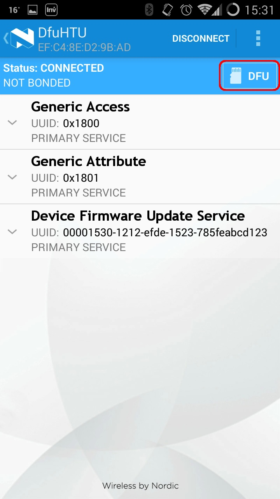
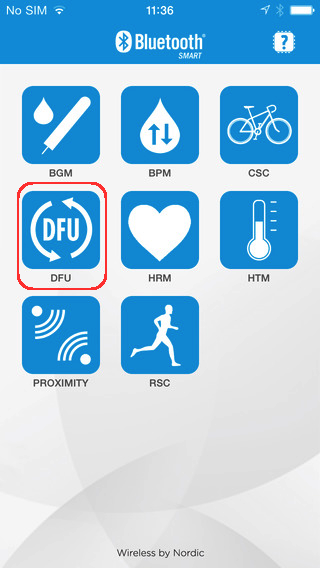

# Flashing a Sensor Module and replacing its Firmware - An Experimental Feature

Since some of our extra Sensor Module functionalities require that the current firmware on it be replaced, we've put together a step by step tutorial for flashing a sensor module. Please find below a version for Android and iOS users. 

### For Android Users

1. Download the new firmware file from the place indicated.
2. In case you have not downloaded the firmware file to your phone, copy it to your phone.
3. Install the Nordic DFU (Device Firmware Update) application. The application compatible with Android is the **nRF Master Control Panel (BLE)**, which can be downloaded from the <a href="https://play.google.com/store/apps/details?id=no.nordicsemi.android.mcp">Play Store</a>
4. Put the Sensor Module which you would like to flash in *DFU Mode*. You can do this by pressing the button on the module and holding for **3 seconds**. The LED will be constantly on when DFU mode is activated.
5. Connect to the Module and open the DFU pane.
6. Press to scan. The module should then appear in the list of available BLE devices. The Device Name is "*Dfu{module_name}*". For example: DfuMIC for the Noise Level Sensor:

7. The app will detect the DFU service and the DFU button will appear. 

8. Press the button and select the Application option. Then select the firmware file downloaded in step 2. 

You can always revert to the original sensor functionality by flashing the modules and re-installing the original sensor firmware. The original firmware for each of the sensor modules can be downloaded from <a href="https://s3-eu-west-1.amazonaws.com/relayr-firmware/BLEModulesFirmware-20140910.zip"> this link </a>. **Please note** that in order to set the iBeacon to DFU mode (so that the firmware could be flashed again) you would need to remove the battery/power supply and then put it back again while maintaining the module's button pressed. 

### For iOS Users 

1. Download the new firmware file from the place indicated.
2. In case you have not downloaded the firmware to your phone, copy it to your phone.
3. Install the Nordic DFU (Device Firmware Update) application. The application compatible with Android is the **nRF Toolbox**, which can be downloaded from the <a href="https://itunes.apple.com/us/app/nrf-toolbox/id820906058?mt=8">Apple Store</a>
4. Put the Sensor Module which you would like to flash in *DFU Mode*. You can do this by pressing the button on the module and holding for **3 seconds**. The LED will be constantly on when the DFU mode is activated.
5. Connect to the Module and open the DFU pane.
6. In the nRF Toolbox, open the DFU Utility. 

7. Select "Application" in the Select File Type setting.
8. Click "Select Device" - the module should appear in the list of available BLE devices.
9. Select "Upload" to upload the new firmware onto the sensor module

Remember, you can always revert to the original sensor functionality by flashing the modules and re-installing the original sensor firmware. The original firmware for each of the sensor modules can be downloaded from <a href="https://s3-eu-west-1.amazonaws.com/relayr-firmware/BLEModulesFirmware-20140910.zip"> this link </a>. **Please note** that in order to set the iBeacon to DFU mode (so that the firmware could be flashed again) you would need to remove the battery/power supply and then put it back again while maintaining the module's button pressed. 