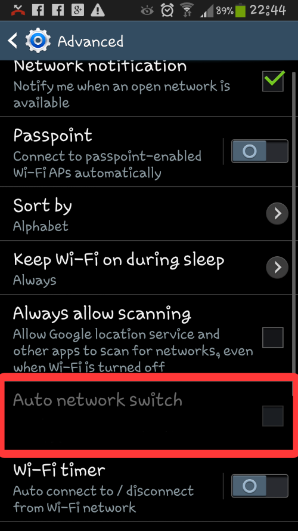
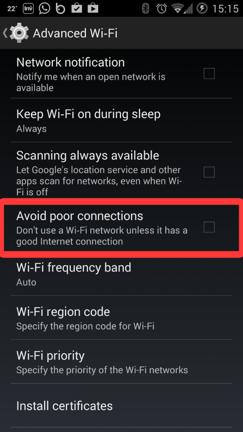

<h1 fullpage> Samsung Galaxy S3 Troubleshooting </h1>

We've identified a configuration setting in the Samsung Galaxy S3 (Model GT-I9300) which when set on prevents the OnBoarding application from successfully onboarding the WunderBar. 
A variation of the setting exists both on models running *Android 4.3* and ones running *Android 4.4* and above.

During the Android onboarding scenario, the phone is required to connect to a local Network called Wunderbar AP to successfully onboard the Master Module. The above setting prevents this connection from being established.

The setting at hand is meant to improve network connectivity when connected via WiFi, when the WiFi network selected is unstable.

## Samsung Galaxy S3 running Android 4.3

In devices running Android 4.3, the setting is called '**Auto Network Switch**'. It is located under Settings > WiFi > Advanced 

in order to reach the WiFi Advanced menu, click on the Little menu icon left to the main control button.

Under the Advanced menu you will find the **Auto Network Switch** which when on, indicates to the phone to switch between 3G and WiFi in the event of an unstable WiFi connection. 

When this setting is on during OnBoarding, the symptom that will be evident is namely inability to connect to the Master Module. The Application will keep attempting to connect to it, asking whether all LEDs are blinking after each attempt.

If you are using the Galaxy S3 running Android 4.3 to onboard your WunderBar, please make sure that this option is *not* ticked.

## Samsung Galaxy S3 running Android 4.4 and above

In devices running Android 4.4, the setting is called '**Avoid poor connections**'. It is located under Settings > WiFi > Advanced 

in order to reach the WiFi Advanced menu, click 'Advanced' on the bottom right side of the WiFi screen.

Under the Advanced menu you will find the **Avoid poor connections** which when on, indicates to the phone not to use a week WiFi network- but rather to always prefer the stable and stronger one. 

When this setting is on during OnBoarding, the symptom that will be evident is again, inability to connect to the Master Module. The Application will keep attempting to connect to it, asking whether all LEDs are blinking after each attempt.

If you are using the Galaxy S3 running Android 4.4 to onboard your WunderBar, please make sure that this option is *not* ticked.