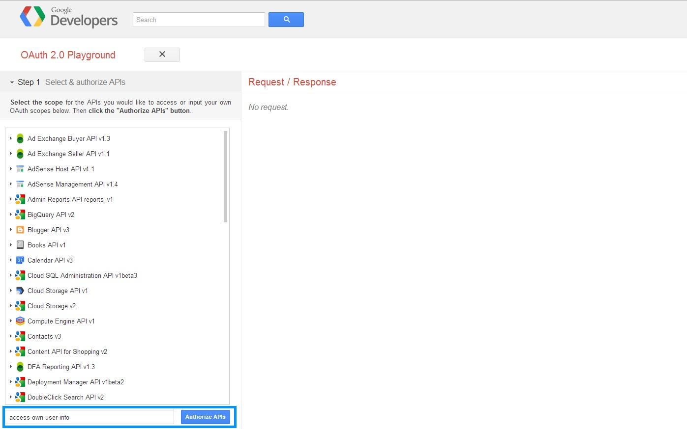
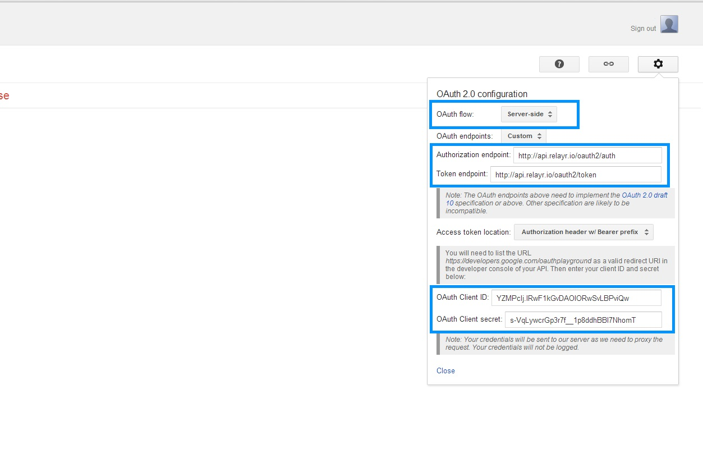

# Getting your relayr OAuth Token via the Oauth Playground

The following steps will enable you to get an OAuth token for your relayr App. To read more about the relayr implementation of the OAuth protocol please visit our <a href="https://developer.relayr.io/documents/Welcome/OAuthReference">OAuth reference </a>. 

## The Access Code Scenario

#### 1. Access the <a href="http://goo.gl/FW1zFb" target="_blank"> OAuthPlayGround URL </a> 

#### 2. The context of the action is predefined:

#### 3. Click the settings menu on the top right corner.

#### 4. Click 'Authorize APIs'.

#### 5. You will be prompted to enter your relayr User credentials.

 

#### 6. Enter your credentials and click to sign in.

#### 7. Click Exchange Authorization code for tokens.

#### 8. The token is received as a JSON snippet in the response.

## The Implicit Grant Scenario

#### 1. Access the <a href="http://goo.gl/FW1zFb" target="_blank"> OAuthPlayGround URL </a> 

#### 2. The context of the action is predefined:

#### 3. Click the settings menu on the top right corner. Select the Client Side scenario from the drop down 

#### 4. Click 'Authorize APIs'.

#### 5. You will be prompted to enter your relayr User credentials.

 

#### 6. Enter your credentials and click to sign in. 

#### 7. The token is received as part of the URL and on the left hand side

