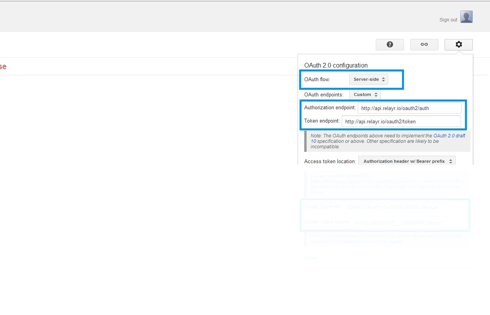
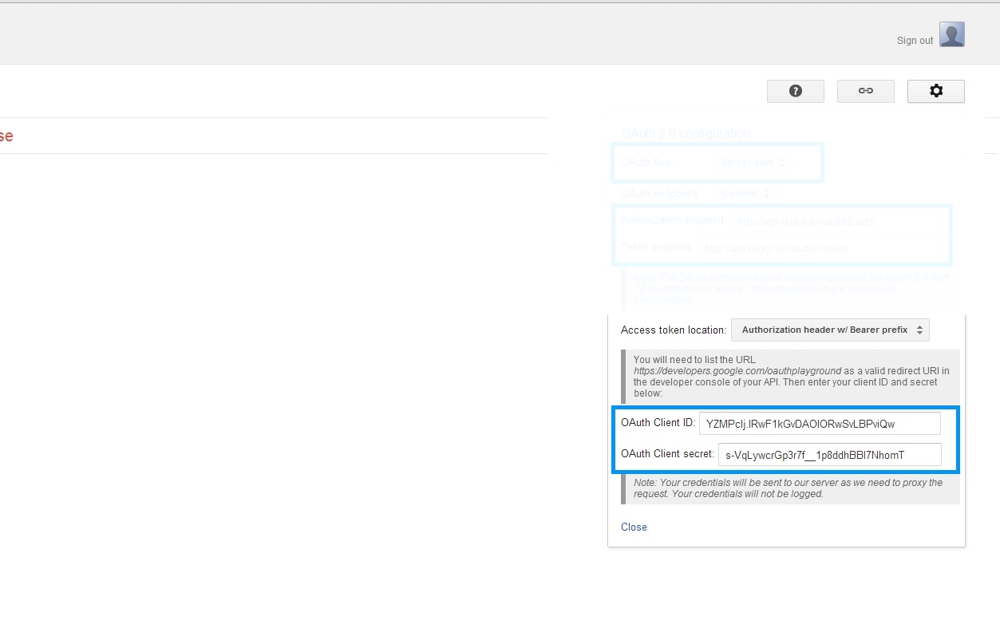
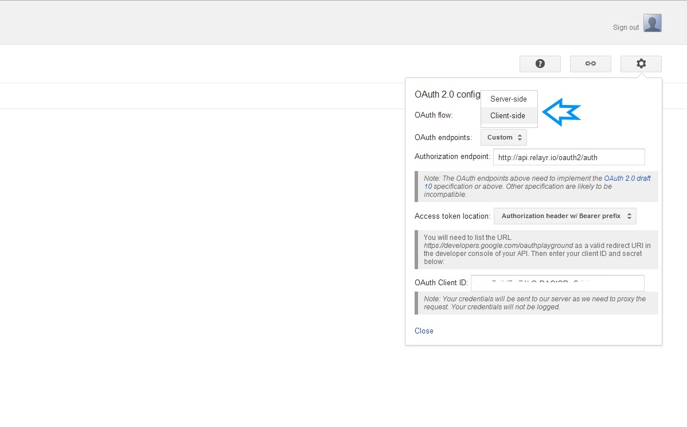
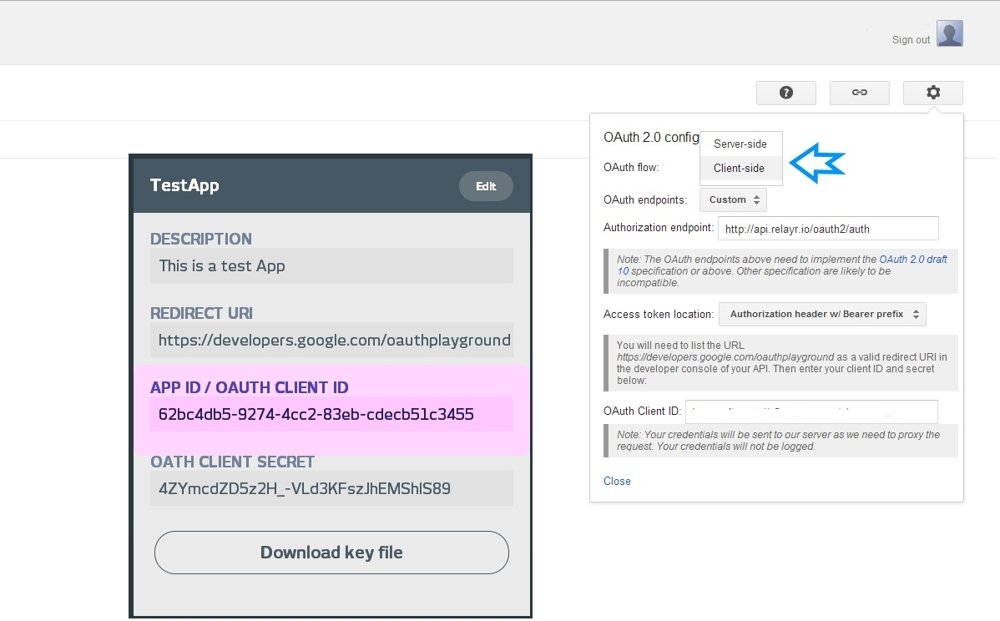
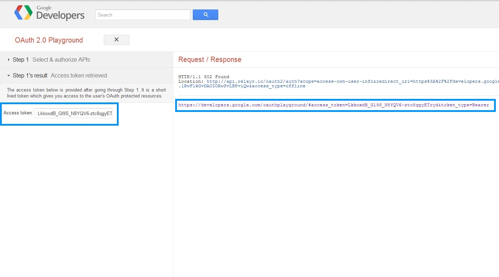

# Getting your relayr OAuth Token via the relayr API 

It is possible to issue your OAuth Application Token by issuing the following API call: 

	https://api.relayr.io/oauth2/appdev-token/{appId}

Where `appId` is the ID of your application. It may be obtained from the [Apps section](https://developer.relayr.io/dashboard/apps/myApps) in the Developer Dashboard.

Please note that this call is included in the API calls which may be imported into your [Postman collections](https://developer.relayr.io/documents/relayr%20API/ImportAPI)

# Legacy - Getting your relayr OAuth Token via the Oauth Playground 

The following steps will enable you to get an OAuth token for your relayr App. To read more about the relayr implementation of the OAuth protocol please visit our <a href="https://developer.relayr.io/documents/Welcome/OAuthReference">OAuth reference </a>. 

## The Access Code Scenario

#### 1. Access the <a href="http://goo.gl/FW1zFb" target="_blank"> OAuthPlayGround URL </a> 

#### 2. The context of the action is predefined:

#### 3. Click the settings menu on the top right corner. Leave the first three fields as indicated:

#### 4. For the two settings at the bottom, copy your App Id and OAuth Client Secret from the [App section in the Developer Dashboard](https://developer.relayr.io/dashboard/apps/myApps): 

#### Make sure to set the redirect URI in the app settings to https://developers.google.com/oauthplayground

#### 5. Click 'Authorize APIs'.

#### 6. You will be prompted to enter your relayr User credentials. Enter your credentials and click to sign in.

#### 8. Click Exchange Authorization code for tokens.

#### 9. The token is received as a JSON snippet in the response.

## The Implicit Grant Scenario

#### 1. Access the <a href="http://goo.gl/FW1zFb" target="_blank"> OAuthPlayGround URL </a> 

#### 3. Click the settings menu on the top right corner. Select the Client Side scenario from the drop down 

#### 4.  Enter the OAuth Client ID as it appears in the App Section of the Developer dashboard and Click 'Authorize APIs':

#### 5. You will be prompted to enter your relayr User credentials. Enter your credentials and click to sign in. 

#### 6. The token is received as part of the URL and on the left hand side

