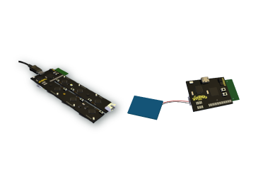
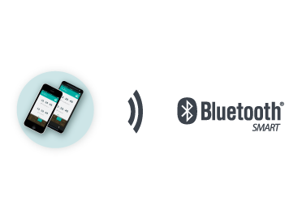
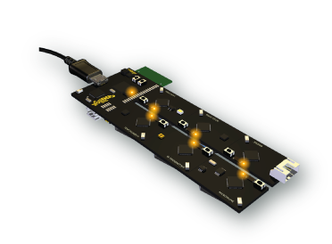
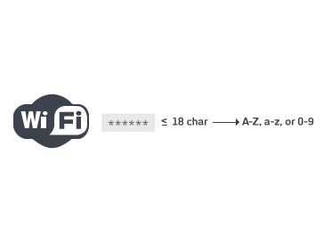

<h1>OnBoarding Dos and Don'ts</h1> 

Here is a quick walk through our 10 OnBoarding Dos and Don'ts. Follow them and you'll be onboarded in no time!

----------

<h1>Dos</h1>

<h3>1. Make sure the Master Module is connected to a power supply via the USB cable <em>and</em> that it is also connected to the battery.
</h3>

<h3>2. Verify  Bluetooth is enabled on your phone.
</h3>

<h3>3. Make sure the Master Module and six sensors are all in on-boarding mode (LEDs are blinking)</h3> 

<h3>4. Check that your WiFi network is a <a href="http://www.maketecheasier.com/find-best-wifi-channel" target="_blank">2.4</a> Ghz one.</h3> 

<h3>5. Make sure your WiFi password includes not more than 18 characters and that all are <a href="http://en.wikipedia.org/wiki/ASCII" target="_blank">ASCII</a> characters</h3> 

----------

<h1>Don'ts</h1>

<h3>1. Don’t onboard in an extremely crowded place with a WiFi network used by a large number of people. This could cause the process to fail</h3>

<h3>2. Don’t break the sensors off the board before all of them have been onboarded</h3>

<h3>3. Don’t onboard while connected to a network which requires signing up (Airports, hotels etc are probably not the best places for onboarding)
</h3>

<h3>4. Don’t onboard more than one WunderBar at a time.</h3>

<h3>5. Don’t onboard while connected to an unstable network. If it often drops, try and find a more stable network</h3>

