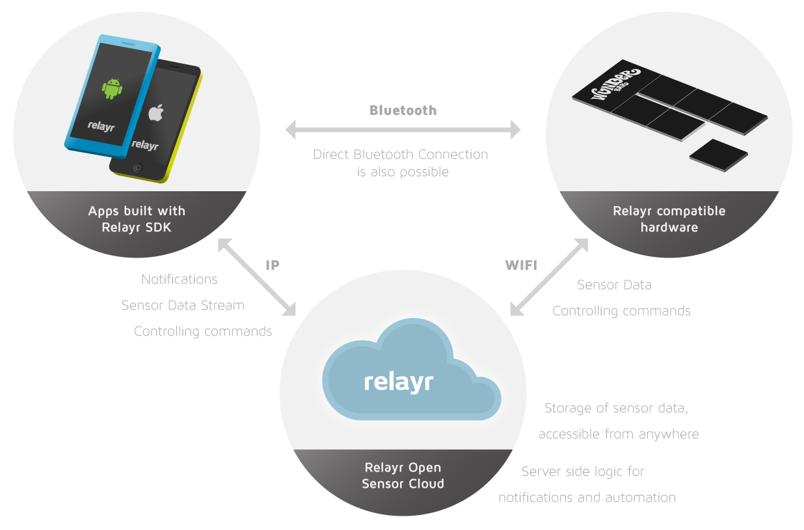

# Documentation

relayr is all about bringing things to life, it's about allowing app developers access to the physical world around them.

We've made it as easy as possible for you to start integrating your awesome apps with the relayr platform. 
Check out our [Registration API](https://developer.relayr.io/documents/Registration/Users), get inspired by our [Android](https://developer.relayr.io/documents/Android/Reference) and [iOS](https://developer.relayr.io/documents/iOS/Reference) SDKs and  don't forget to have a look at our [Authorization Protocol](https://developer.relayr.io/documents/Authorization/Reference) and most importantly, have loads of fun! 

