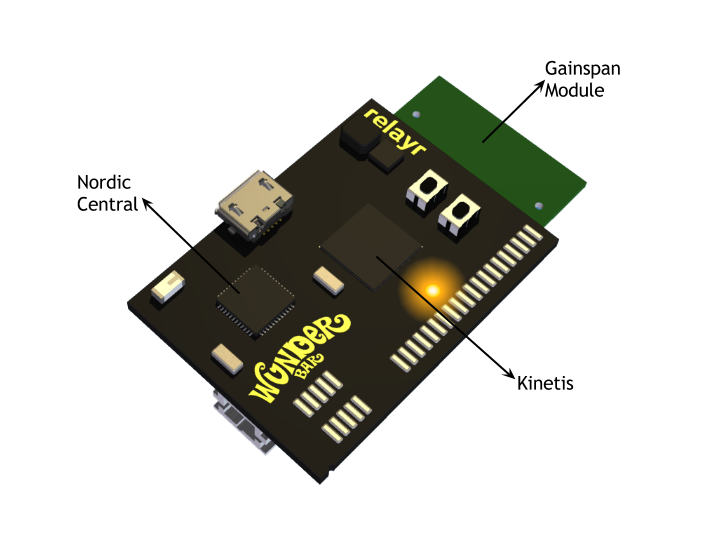

# The WunderBar Master Module

The Master Module is the master mind behind the WunderBar. It is the only module capable of connecting to Wifi and is responsible for delivering data from the sensors to the cloud and from the cloud to the sensors. We'd like to give you a some insight into the relayr Master Module. 

The Master Module consists of three main parts, each responsible for a different aspect of its overall functionality: 

### The Gainspan module 

Incorporating the <a href="http://www.gainspan.com/gs1500m">GS1500m chip,</a> the Gainspan module is responsible for WiFi communication. It initiates the communication with the relayr cloud, utilizing the MQTT/SSL protocol and is responsible for the connection with the MQTT broker.

### The Kinetis module 

Incorporating the <a href="http://www.arm.com/products/processors/cortex-m/cortex-m4-processor.php">ARM Cortex M4</a>, the <a href="http://www.freescale.com/webapp/sps/site/overview.jsp?code=KINETIS_K_SERIES" target="_blank"> Kinetis K Series </a>, manufactured by Freescale, is the core chip on the Master Module.
It stores and maintains all the authorization keys are secrets for the communication with the <a href="https://developer.relayr.io/documents/Welcome/Platform">Cloud Platform </a> and the communication with the Sensor Modules. 
It includes a calculating unit which converts the <a href="https://developer.relayr.io/documents/Welcome/Sensors">raw readings data arriving from the sensor modules </a> into meaningful readings. It also 'translates" BLE into JSON/MQTT - enabling both the SDKs and the Cloud Platform to communicate with the sensor modules.
It communicates with the Gainspan module instructing it when to connect to WiFi and with which credentials. 
Lastly, it runs the Bootloader application which manages the firmware upgrade. 

### The Nordic Central module

Incorporating the <a href="https://www.nordicsemi.com/eng/Products/Bluetooth-Smart-Bluetooth-low-energy/nRF51822"> nRF51822 </a> chip this module is responsible for all Bluetooth Low Energy communication including scanning for available BLE devices and connecting to them as well as scanning for the OnBoarding service during the onboarding process.  
