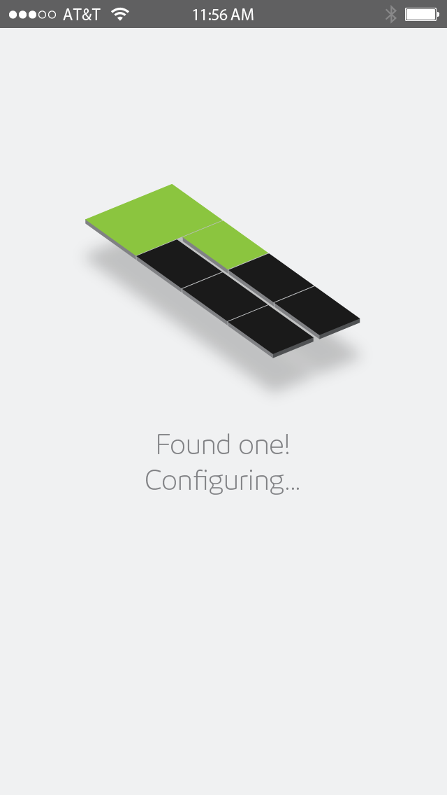
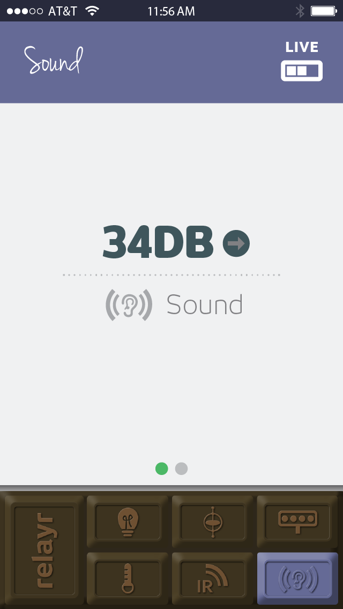

# The Onboarding Process - Welcome Aboard!

## Why?

The OnBoarding process is your way of telling the relayr platform - "I'm a relayr User and this is my WunderBar". 
It allows you to connect the specific Sensors and Master Module you received in the mail with your relayr user and it pairs the specific Master Module with its respective sensor modules, so that when they start collecting data, only your Master module will be able to pick up that data and transmit it to the relayr <a href="https://developer.relayr.io/documents/Welcome/Platform" target="_blank">Cloud Platform</a>, making it  available for your app.
 
## How?

OnBoarding is currently only available via one of our onboarding apps- iOS or Android. You can find links to download the apps on <a href="https://developer.relayr.io/dashboard/onboarding" target="_blank">this</a> page.

## What?

What essentially takes place during the onboarding process is the following:
The OnBoarding app posts a request to the relayr API, to register a new WunderBar.The API processes the request and returns a set of IDs and Secrets to be written to the Master Module and the six Sensor Modules. The IDs and Secrets ensure that only the specific Master Modules is then able to receive data from the specific sensors and further transmit it. 

 

 

## Ready to OnBoard?
Whether you are an Android developer an iOS developer or a Web developer eager to create amazing apps, based on the WunderBar sensor modules, your first step in the relayr world is  onBoarding. Once your sensors and Master Module are onboarded you will be able to receive the first sensor readings which will be displayed in the app. 

   

So... Are you ready to OnBoard? - Great! 

Go to the <a href="https://developer.relayr.io/dashboard/onboarding" target="_blank">OnBoarding app Download page </a> 