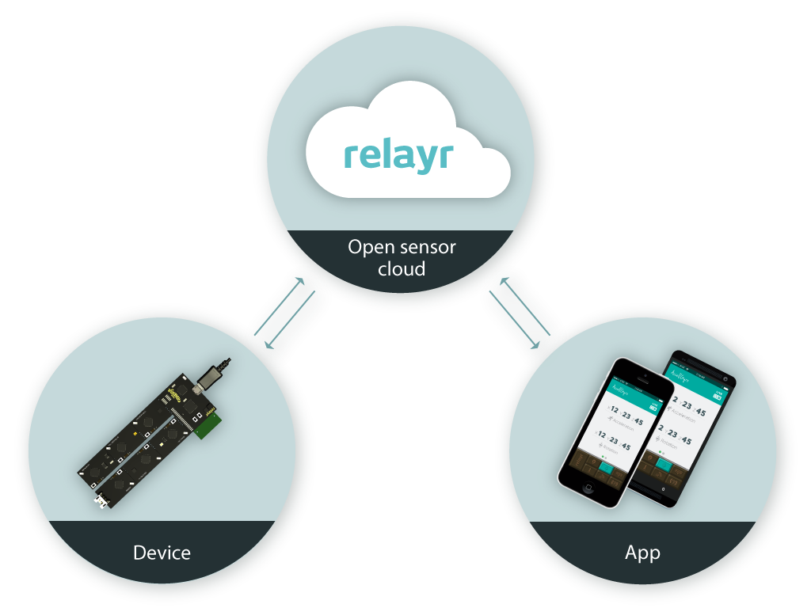
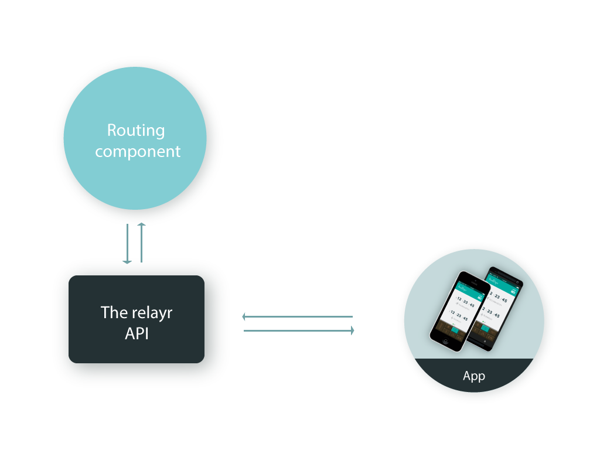
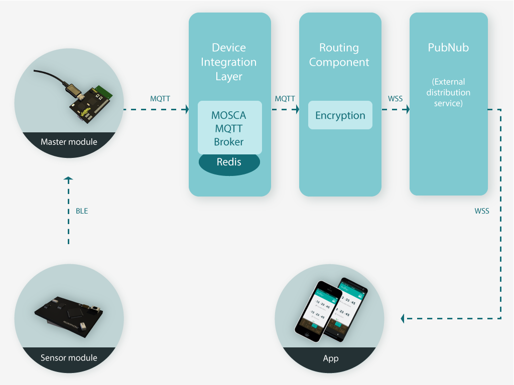

# Introduction to the relayr Cloud Platform

## Overview

relayr provides you with a powerful platform which mediates between your applications and data gathered by sensors and other devices. It enables you to use this data regardless of the format and method in which it is gathered. 
We would like to introduce the benefits of using the cloud platform and help you better understand what it's all about.

## Why Use the relayr Cloud Platform?

As opposed to directly connecting an app  to the sensor modules over BLE (Bluetooth Low Energy), using the platform to connect to sensor modules and other devices can be achieved regardless of location and distance, it ensures that data is securely stored and is then available for further manipulation. 

The platform receives data from the devices, stores it and distributes it only to the applications which incorporate the relayr SDK and meet the authorization criteria established when first registering on the platform.

Historical data retrieval, conditional messaging, integration with a variety of iOT devices, and rule-based data retrieval are only a few of the options made available.

The relayr cloud platform also allows data normalization. Data is available in one format which the relayr SDK makes easy for processing, rendering the actual source of the data transparent. 

In case you are a device manufacturer you can also enjoy the simplicity enabled by the relayr platform. Simple integration with the platform introduces your devices to a world of developers who otherwise would not have had the ability to use your device readings.

## How does it work?

### Registration
The first stage that enables you to step into the relayr world is the ***registration***. In this stage all basic entities such as the User, App, Device are introduced to the platform. The registration is done via the relayr Developer Dashboard. 

 

### OnBoarding 
The OnBoarding stage enables you to establish the pairing between your devices and your user credentials. the specific pairing credentials- authorization and encryption keys - are generated and maintained by the relayr routing component, mediated by the relayr API.  

### Flow

To give you a small taste of the way the platform works, here's a high-level description of the **Device > Cloud Platform > App** data flow

1. The Sensor Module delivers its readings over BLE to the Master Module which serves as a transmitter. The Master Module is the only module capable of communicating over WIFI. 
 
1. The Master Module delivers the data to the Device Integration Layer. The latter is essentially a Redis Cluster based PubSub server. The data is delivered over secure MQTT (MQTT/TLS). 
 
1. The data is distributed throughout the different cluster nodes and is either pushed to available subscribers or maintained in the cluster.
1. The relayr Routing Component, which  subscribes to the specific device channel during the onBoarding process receives the data from the Device Integration Layer and encrypts it before sending it further.
 
1. The encrypted data is then delivered over WSS (Secure Web Sockets) to PubNub - an external service which serves as a distributor only. PubNub delivers the data received to the application subscribed to the specific device channel; a subscription which is also performed during the onBoarding process.

Now that we've raised your curiosity about the relayr platform, check out our [Android SDK](https://developer.relayr.io/documents/Android/Reference) and [iOS framework](https://developer.relayr.io/documents/iOS/Reference) to learn how to make it work for you! 