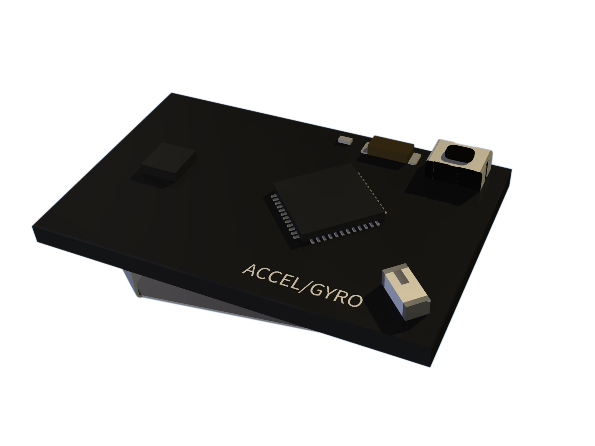
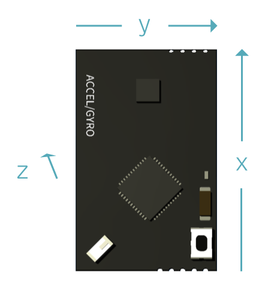
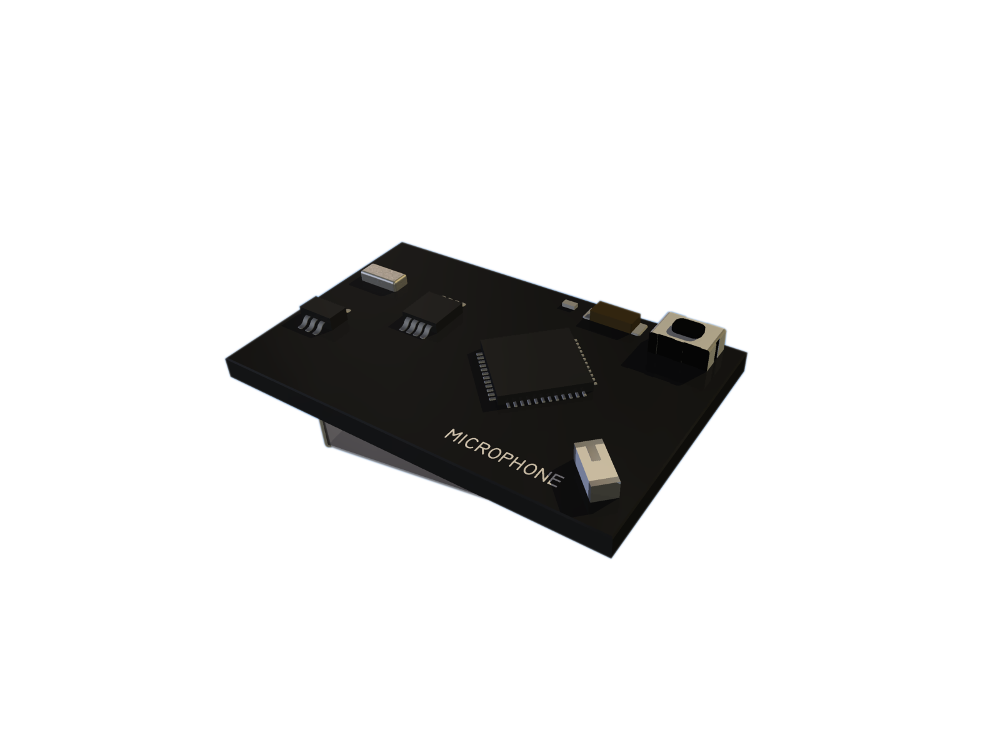
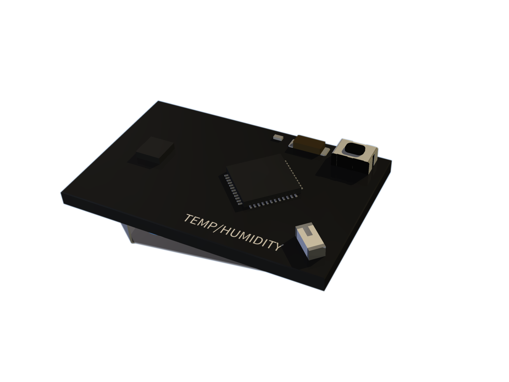
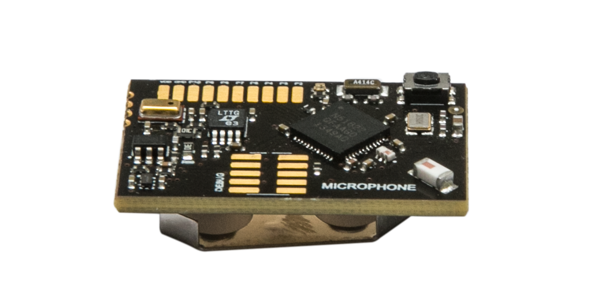
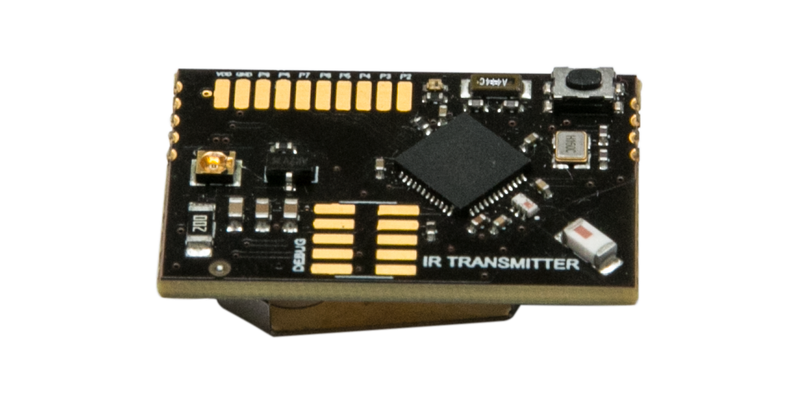
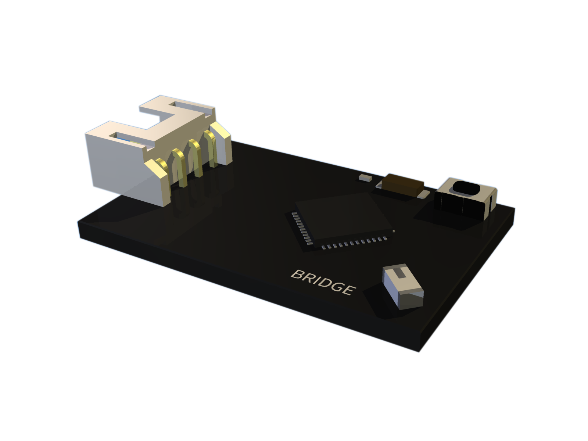

# Making Sense of Sensors 

 We keep on referring to our six Sensor Modules and we realize that we haven't taken the time to tell you what these are. So we are going to do just that in this next section. Lets make sense of some sensors. 
 

The six modules which make the WunderBar are: the **accelerometer/gyroscope** sensors, the **light/color/proximity** sensors, the **temperature/humidity** sensors, the **sound level** sensor, the **infrared transmitter** and the **grove (bridge) module**. Each of the modules has BLE connection capabilities, includes a coin battery holder and an LED. We'll get to the nitty gritty of each of the modules in a moment, but first we'd like to say a few words about the LED status - so you'd know what each blink means

All sensor modules have one led each, here's a quick explanation of the different LED statuses

<ul>
<li>
<strong>LED Blinking once a second</strong>: During Onboarding Mode. The module is advertising the Onboarding service, to be written to by the Onboarding App.
</li>

<li>
<strong>LED ON</strong>: Indicating that the sensor is in Over The Air- Device Firmware Update (OTA-DFU) mode. The DeviceFirmwareUpdate application is running, waiting for the Android/iOS app to send new firwmare.
</li>

<li>
<strong>LED OFF</strong>: Normal operation.
</li>
 
<li>
<strong>Short Blink</strong>: The sensor module will blink once when to indicate that it is connected to the App or the Master Module.
</li>
</ul>

Now that we've made sense of the LEDs lets make some sense of sensors...

 
<h2>The Accelerometer/Gyroscope Module</h2>
</a>

This module incorporates the <a href="http://www.invensense.com/mems/gyro/mpu6500.html">MPU-6500 chip</a> manufactured by InvenSense, combining a 3-axis accelerometer with a 3-axis gyroscope.

       

<h3>The Accelerometer</h3>

An accelerometer is an electromechanical device used to measure <em>proper</em> acceleration ("g-force") as opposed to <em>coordinate</em> acceleration (the rate of the change in velocity). 
 
The MPU-6500 integrates a 3-axis micro-electro-mechanical system (MEMS) accelerometer, which consists of 3 sensors measuring acceleration on the X, Y and Z axes. The acceleration can be either positive or negative depending on the direction of deviation.

 
The accelerometer outputs a raw 16-bit figure which is then converted either by the Master Module or, in the future case of Bluetooth LE direct connection (a scenario in which an app is directly connected to the sensor, without the mediation of the relayr Cloud), by the SDK incorporated in the app.
 
The sensor includes user-programmable ranges of -2g to +2g, -4g to +4g, ±8g, and ±16g. The default scale according to which the raw values are currently converted, by the Master Module, is the ±2g scale.    

<h4>Sensor Data Attributes</h4>
<table>
<tr>
<td>meaning</td>
<td>unit</td>
<td>maximun</td>
<td>minimum</td>
<td>resolution</td>
</tr>

<tr>
<td>acceleration</td>
<td>g</td>
<td>2</td>
<td>-2</td>
<td>0.01</td>
</tr>
</table>

<h3>The Gyroscope</h3>

A <a href="http://en.wikipedia.org/wiki/Gyroscope">gyroscope</a> measures the angular rate of movement, i.e. the speed of the change in the angle of an object - across all axes. The output of a gyroscope is indicated in degrees per second (°/sec). 

 	 
The gyroscope includes user-programmable ranges of ±250, ±500, ±1000, and ±2000 °/sec. The default configured sensitivity is ±250 °/sec.

  

<h4>Sensor Data Attributes</h4>
<table>
<tr>
<td>meaning</td>
<td>unit</td>
<td>maximun</td>
<td>minimum</td>
<td>resolution</td>
</tr>

<tr>
<td>angular_speed</td>
<td>degrees_per_second (°/s)</td>
<td>250</td>
<td>-250</td>
<td>0.01</td>
</tr>
</table>

----------

<h2>The Light/Color/Proximity Module</h2> 
</a>
	

This module integrates the <a href="http://www.ams.com/eng/Products/Light-Sensors/Color-Sensor-Proximity-Detection/TCS37717"> TCS3771 IC </a>, manufactured by AMS AG. (formerly TAOS Inc.). This IC integrates RGB Color Sensing and Proximity Detection in a single device. In addition, the module has an Infrared LED, used for proximity detection and a white LED used to illuminate targets when the color sensor is measuring. 

       

<h3>The Proximity Sensor</h3>

For proximity detection an external InfraRed LED is used to emit light, which is then measured by the integrated light detector to determine the amount of reflected light from the object in the light path.  
The amount of light detected from a reflected surface can then be used to determine the object’s proximity to the sensor.  
An internal LED driver can be configured to provide a constant current of 12.5 mA, 25 mA, 50 mA or 100 mA. The higher the current, the larger the detection range is, reaching about 50 cm of proximity detection.  
The number of proximity LED pulses can also be programmed. The power consumption of the entire module will be directly affected by these configurations. The higher the LED current. and the larger the number of pulses is, the higher the power consumption will be.  
The digital value, which is received from the sensor is then translated by the Android and iOS SDKs and the Developer Dashboard, to a percentage which denotes the level of proximity. The higher the percentage is, the closer the object is to the sensor.
Since the parameter measured is essentially the amount of light reflected from the object, varying light conditions will affect the measurements of the sensor.

<h4>Sensor Data Attributes</h4>
<table>
<tr>
<td>meaning</td>
<td>unit</td>
<td>maximun</td>
<td>minimum</td>
<td>resolution</td>
</tr>

<tr>
<td>proximity</td>
<td>none</td>
<td>2047</td>
<td>0</td>
<td>1</td>
</tr>
</table>

	
<h3>The Light/Color Sensor</h3>

When an object is placed in measurement distance from the light/color/proximity module, the proximity sensor in the module will detect the target and turn on the white LED integrated in it. During this time, the 4 channels of the color sensor - red, green blue and white - will detect the amount of light reflected off the object and integrate the signal into a digital value. 
Different objects reflect light in different wavelengths and in different amounts. That is how the <a href="http://en.wikipedia.org/wiki/Color_vision">human eye perceives color</a>. 
In a similar manner, the color sensor produces a set of values which are then translated by the relayr Android and iOS SDKs and the Developer Dashboard into 'color' according to the <a href="http://en.wikipedia.org/wiki/RGB_color_model">RGB color model</a>  

<h4>Sensor Data Attributes - Light</h4>
<table>
<tr>
<td>meaning</td>
<td>unit</td>
<td>maximun</td>
<td>minimum</td>
<td>resolution</td>
</tr>

<tr>
<td>luminosity</td>
<td>none - raw data</td>
<td>4096</td>
<td>0</td>
<td>1</td>
</tr>
</table>

<h4>Sensor Data Attributes - Color</h4>
<table>
<tr>
<td>meaning</td>
<td>unit</td>
<td>maximun for each channel</td>
<td>minimum for each channel</td>
<td>resolution for each channel</td>
</tr>

<tr>
<td>color</td>
<td>rgb (3 channels)</td>
<td>4096</td>
<td>0</td>
<td>1</td>
</tr>
</table>

----------

<h2>The Temperature/Humidity Module</h2> 
</a>

 This module integrates the <a href="http://www.meas-spec.com/product/humidity/HTU21D.aspx">HTU21D chip</a>, manufactured by Measurement Specialties™. The HTU21D is a digital Relative Humidity Sensor with Temperature Output.

            

   
<h3>The Temperature Sensor</h3>

The Module utilizes a semiconductor-based temperature sensor. The obtained digital output is proportional to room temperature. 
The resolution of the sensor is configurable to an 11 - 14 bit representation. The resolution (the minimum change in temperature that would be reflected in the measurement) is 0.01 ºC for the 14 bits configuration and 0.04 ºC for the 12 bits one. The range of measurable temperature is -40 to +125 ºC. The typical accuracy is ±0.3 ºC.  
Please note that in case the module is still attached to the Master Module it will reflect a temperature about 2-3 degrees higher due to heat emitted by the WiFi module which is part of the Master Module.

<h4>Sensor Data Attributes</h4>
<table>
<tr>
<td>meaning</td>
<td>unit</td>
<td>maximun</td>
<td>minimum</td>
<td>resolution</td>
</tr>

<tr>
<td>temperature</td>
<td>celsius (°)</td>
<td>100</td>
<td>-100</td>
<td>0.01</td>
</tr>
</table>

<h3>The Humidity Sensor</h3>

The humidity sensor is based on a polymer which is water absorbent and changes the electric conductivity of a circuit to which it is connected, as a result of the amount of water it absorbs.  
The sensor measures relative humidity (RH), which is the ratio of the pressure of water vapor to pressure of water saturation vapor in the same temperature.  
Relative humidity depends on the temperature of the environment measured. 
<be/>
Much like the temperature sensor, the humidity resolution can be configured to a 8-12-bit resolution. The resolution of the measurement is 0.04% RH for the 12 bits configuration and 0.7% RH for 8 bits one. The relative humidity accuracy is ±2 %RH at 25°C (between 20% and 80 %RH).

<h4>Sensor Data Attributes</h4>
<table>
<tr>
<td>meaning</td>
<td>unit</td>
<td>maximun</td>
<td>minimum</td>
<td>resolution</td>
</tr>

<tr>
<td>humidity</td>
<td>precent(%)</td>
<td>100</td>
<td>0</td>
<td>1</td>
</tr>
</table>

----------

 
<h2>The Sound Sensor Module </h2>
</a>

This sensor measures the average <a href="http://en.wikipedia.org/wiki/Ambient_noise_level">ambient noise level</a>. It is based on the <a href="http://www.knowles.com/Products/Microphones/Surface-mount-MEMS">SPU0410HR5H chip</a> manufactured by Knowles, a MEMS microphone and its associated analog and digital circuitry. 
The MEMS microphone transforms air pressure variations into a low voltage analog signal, which is then amplified by about 100 times and conducted to a converter, which averages the analog signal and provides an RMS output value that can be measured with the ADC (analog-to-digital converter).  
The noise sensor was adjusted to be more sensitive to common noise sources such as human voices, music and traffic sounds. The obtained output value resolution is a number between 0-1024, which represents the average noise level over a short period of time. The sound level sensor module will provide one reading in every measurement interval (the default interval is one second).  
Note that the output provided by the sensor is <em>not</em> presented in decibels. A much more elaborate set of tools is required to supply that measurement. Our sensor essentially provides a reading representing the change in noise level over a period of time. The output number will increase as the noise level rises and vice versa.

<h4>Sensor Data Attributes</h4>
<table>
<tr>
<td>meaning</td>
<td>unit</td>
<td>maximun</td>
<td>minimum</td>
<td>resolution</td>
</tr>

<tr>
<td>noise_level</td>
<td>none - raw data</td>
<td>1023</td>
<td>0</td>
<td>1</td>
</tr>
</table>

----------

 
<h2>The InfraRed Module </h2>
</a>

This module is based on the <a href"http://www.osram-os.com/osram_os/en/products/product-catalog/infrared-emitters%2c-detectors-andsensors/infrared-emitters/power-emitter-gt40mw/emitter-with-940-nm/sfh-4441/index.jsp">SFH4441 chip </a> manufactured by OSRAM GmbH and 
is a high efficiency, high power infrared emitter. 
 
The IR Led is controlled by the main Nordic chip, which includes an implementation of the the <a href="http://techdocs.altium.com/display/FPGA/NEC+Infrared+Transmission+Protocol"> NEC code protocol </a>.  
This protocol is used by many remote-controlled consumer electronic devices, such as TVs, Audio Systems and LED light strips such as <a href="http://www.conrad.de/ce/de/product/779276/Mueller-Licht-Dekobeleuchtung-LED-Strip-36-W-5-m-57003-LED/?ref=home&rt=&rb=1">this one</a>.  
Using the relayr SDKs, it is possible to control a variety of home appliances, using this sensor module.  
In future releases we plan to implement additional IR protocols to be used by this module.
  

	
 

----------

 
<h2>The Bridge Module </h2>
</a>

This module includes 8 exposed General-purpose input/output points (GPIOs), as well as a 4-pin connector, compatible with Grove modules from <a href="http://www.seeedstudio.com/depot/?gclid=CLT_q6Ous8ACFfOhtAod3T4Adw">SeeedStudios </a>. This connector incorporates two 3.3V to 5V compatible GPIOs, that can be used as Digital Inputs and Outputs, as <a href="http://en.wikipedia.org/wiki/I%C2%B2C">I2Cs</a> or as <a href="http://en.wikipedia.org/wiki/Universal_asynchronous_receiver/transmitter">UART ports</a>. 
The firmware on the Bridge Module is intended to control some of the digital modules of the Seeed Grove family, such as the <a href="http://www.seeedstudio.com/wiki/Grove_-_Solid_State_Relay">Solid State Relay</a> , or the <a href="http://www.seeedstudio.com/wiki/Grove_-_Vibration_Motor">Vibration Motor</a> with a simple command from the relayr SDKs or the Developer Dashboard. 
We are working on additional exciting devices which could be integrated with relayr via the bridge module- so stay tuned!

