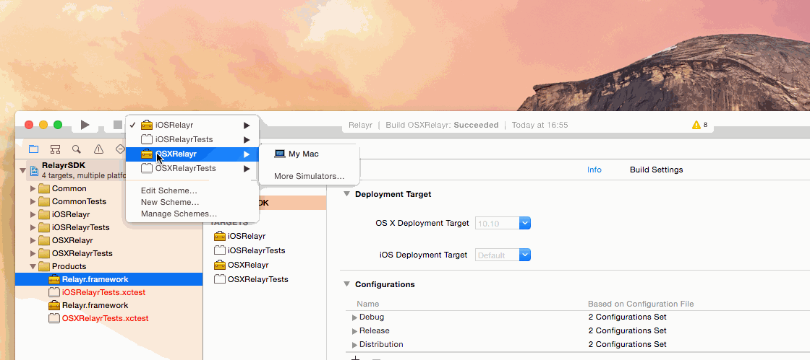
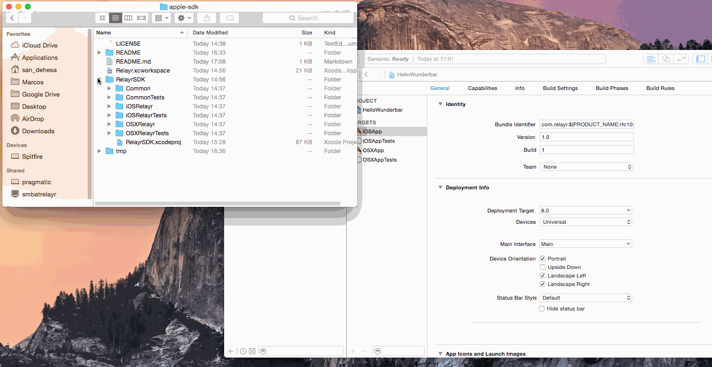

# Introduction
------------
Welcome to the relayr Apple-SDK repository.
This repository contains the code which allows you to build the relayr Framework for iOS and MAC OS X. The *RelayrSDK* project generates a product called `Relayr.framework`, which, depending on your use purpose, can be run on a mac or on an iOS device.

Currently, the only dependecy of the project is the PUBNUB library. 
If you are interested in building the framework *for iOS devices*, you will require **Xcode 6 and iOS 8**, since embedded frameworks have only been introduced in iOS 8 enable devices. 
For Mac applications, you can use Xcode 5.

## Getting Started - The Build process

There are currently two methods of including the `Relayr.framework` in your project:

#### Method 1: 
#####Getting the *.framework* file and dragging and dropping it into your project.

  * Download or generate the `Relayr.framework` file:
     
     
  
  * Drag and drop the file into your project and make sure that the framework appears both in *Embedded Binaries* and in *Linked Frameworks and Libraries*:
     
     

#### Method 2: 
#####Integrating the *RelayrSDK* project as a subproject of your workspace and then dragging and dropping the `Relayr.framework` product into the *Embedded Binaries* tab:

  

## Usage

The `Relayr.framework` includes a small subset of useful classes, which allow you to communicate with the relayr cloud, receive sensor data and manage users, devices transmitters and other entities. At the moment The BLE Direct Connection Classes are not fully implemented but they should be available in upcoming releases. The classes indicated below are all related to App > Cloud > Device communication.  
All calls are asynchronous and the server response time is proportional to the quality of your connection and the size of the response requetsed.

#### `RelayrCloud.h`

Used as a static class to receive several statuses on the relayr servers.

  ```objective-c
  [RelayrCloud isReachable:^(NSError* error, NSNumber* isReachable){
      if (isReachable.boolValue) {
          NSLog(@"The Relayr Cloud is reachable!")
      }
  }];
  ```

####`RelayrApp.h`

A representation of your iOS/OSX app on the Relayr Cloud. 

You create an object with the respective *appID*, *OAuthClientID*, *OAuthClientSecret*, and *redirectURI* generated when you first create your application on [the Developer Dashboard Apps section](https://developer.relayr.io/dashboard/apps/myApps).

  ```objective-c
  [RelayrApp appWithID:@"..." OAuthClientID:@"..." OAuthClientSecret:@"..." redirectURI:@"..." completion:^(NSError* error, RelayrApp* app){
      if (app) {
          NSLog(@"Application with name: %@ and description: %@" app.name, app.description);
          self.app = app;
      }
  }];
  ```
  
  You can check your app's properties, query the server for information related to it, or sign users in and out of it.
  
  ```objective-c
  [self.app signInUser:^(NSError* error, RelayrUser* user){
      if (user) {
          [self.users addObject user];
      }
  }];
  ```

#### `RelayrUser.h` 

Represents a logged-in user. 
Users can access device data. They can query transmitters/devices they own, bookmark favorite devices and become app publishers. 
You can have as many logged in users as you want.

  ```objective-c
  RelayrUser* user = ...;
  NSLog(@"User with name: %@ and email: %@", user.name, user.email);
  
  // Lets ask the cloud for all the transmitters/devices own by this specific user.
  [user queryCloudForIoTs:^(NSError* error, NSNumber* isThereChanges){
      if (error) { return; }
      
      for (RelayrTransmitter* tran in user.transmitters)
      {
          NSLog(@"Transmitter's name: %@", tran.name);
      }
      
      for (RelayrDevice* dev in user.devices)
      {
          NSLog(@"Device's name: %@", dev.name);
      }
  }]
  ```

#### `RelayrTransmitter.h` 

An instance representing a *Transmitter*. A transmitter is one of the basic relayr entities. 
A transmitter, contrary to a device does not gather data but is only used to *relay* the data from the devices to the relayr cloud platform. The transmitter is also used to authenticate the different devices that transmit data via it.
In the case of the relayr WunderBar, the transmitter is the Master Module in the Cloud Platform scenario (data being sent from the sensors by the Master Module to the relayr cloud over MQTT/SSL). In the future case of direct connection the an app running on your phone could serve as a transmitter.

#### `RelayrDevice.h` 

An instance representing a *Device*. A device is another basic relayr entity. 
A device is any external entity capable of producing measurements 
and sending them to a transmitter to be further sent to the relayr platform, or one which is capable of receiving information from the relayr platform. 
Since a single relayr device can produce more than one reading at the same time, you should always first query device capabilities.
