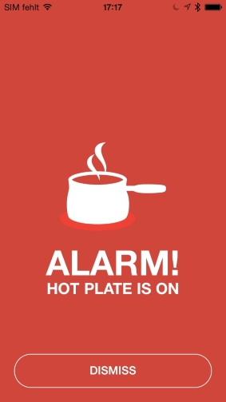
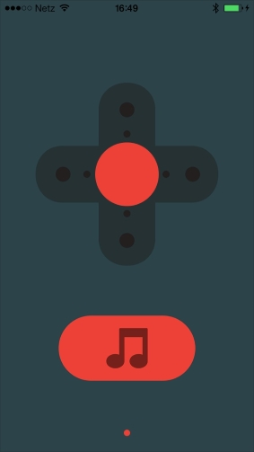

# Sample Projects

Here you'll find links to some sample iOS projects which would hopefully inspire to create your own apps. 

## The Hot Plate App

The purpose of the HotPlate app is to send you a notification about a forgotten oven or stove prior to your closing your bedroom door and going to sleep. The two sensors which are used in this project are the HTU sensor and the GYRO sensor. 
The app, in this scenario, utilizes the direct connection model, it connects to the sensors directly without the mediation of the relayr cloud.

Here's a link to the project on GitHub: <a href="https://github.com/relayr/iOSDemoHotPlate/" target="_blank"> https://github.com/relayr/iOSDemoHotPlate/ </a> 

## The Spider App

Our Spider app makes sure that our little spider robot never stops moving around. The app utilizes the direct connection and uses the Grove Connector in order to connect to two motors which are in turn connected to two sets of arms. The app controls the velocity and direction of the robot's motion and for extra fun, when a little button is tapped, it starts dancing!

Here's a link to the project on GitHub: <a href="https://github.com/relayr/iOSDemoRobot" target="_blank"> https://github.com/relayr/iOSDemoRobot </a> 

 
