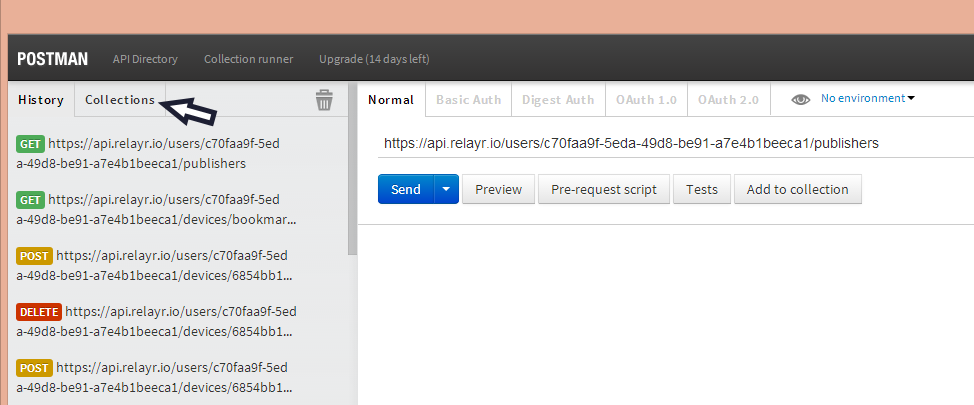
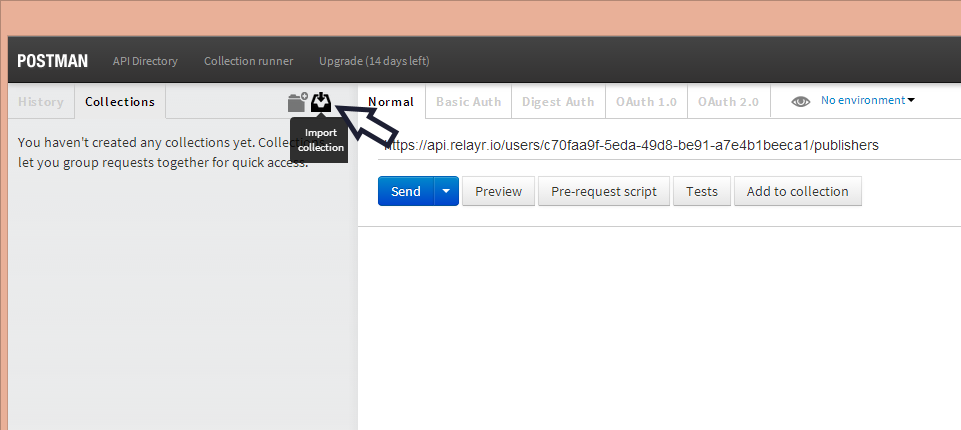
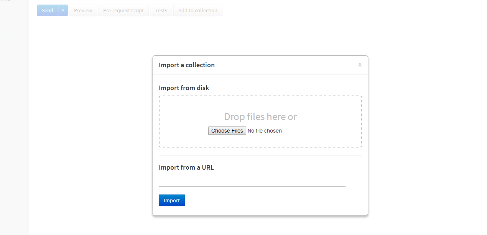
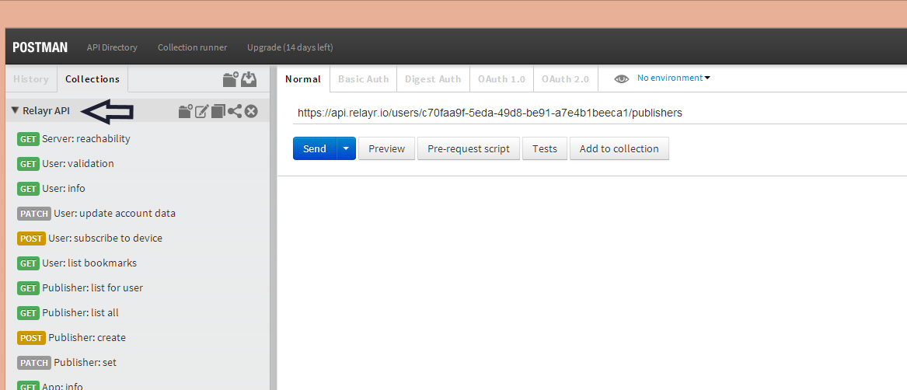
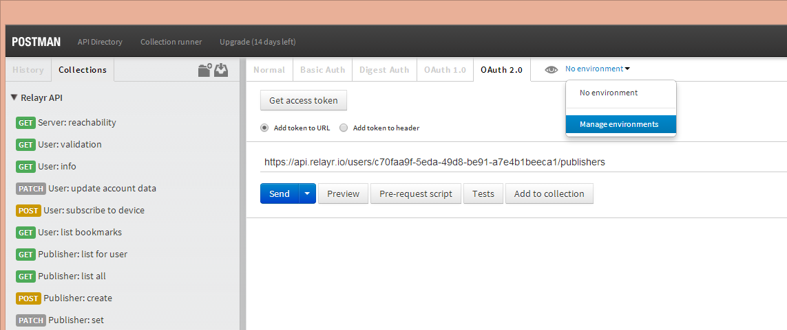

# Adding the relayr API calls to your Postman console

Here's a quick way to add the relayr API calls to your Postman collections

## Instructions

#### Open Postman and click on the Collections tab:

#### Click the Import Collection button:

#### You will be prompted with the import screen. 
#### Add the following URL to the Import section: *https://www.getpostman.com/collections/03a35767b02128c7f997* and click "Import".

#### Upon successful import, you will be prompted with the following window:

#### Close the window and note that the Relayr API collection has been added to your collections list:

#### To use the calls, you will need to set the required tokens and parameters under the Environment Tab. Click it to create a new Environment:

#### See Example:

** Please note that the live sensor data stream cannot be viewed with Postman as the protocol which is used for data transferring is MQTT rather than HTTP. In order to view your live data stream you are able to use an MQTT client such as [Mosquitto](http://mosquitto.org/). Alternatively you are able to use [this web client](https://mqtt.relayr.io/) 

You will find the information required  in your [Apps Page](https://developer.relayr.io/dashboard/apps/myApps), and your [Devices Page](https://developer.relayr.io/dashboard/devices). To Generate your OAuth token, please see instructions [here](https://developer.relayr.io/documents/Browser/OAuthToken) 