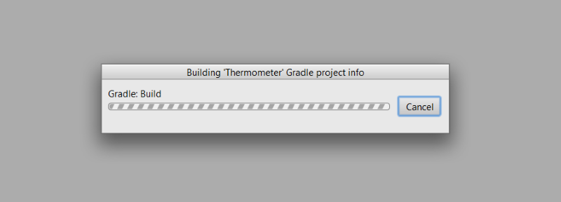
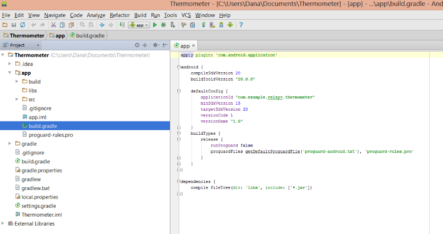
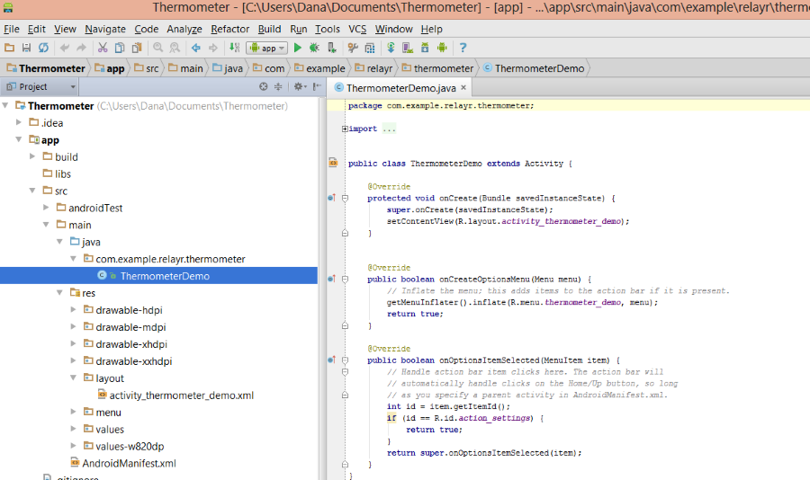
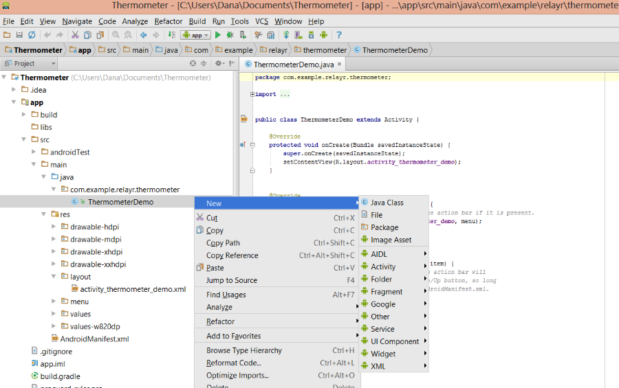

# Building your First relayr Android App - A Step by Step Tutorial

We cannot all be Android Developers. What if we told you that you don't really have to be an Android developer in order to start building apps for relayr? 

Have a look at this easy to use step by step thermometer app which will walk you through building your first Android relayr app. We've broken it down into 9 steps, including setting up Android Studio so you too would get an idea of what app development is all about.

Ready to get started? Let's Go!

<h2 class="collapseHeader">Step 1: Setting up your Android Environment</h2>

Here are a few preliminary steps you would need to follow in order to get your development environment all ready for building you first app. 

<h3>Download <a href="https://developer.android.com/sdk/installing/studio.html">Android Studio</a></h3>

<h3>Create an Android Project on Android Studio</h3>
<h4>Give your project a name</h4>

<h4>Set the minimum supported version</h4>

The minimum supported version for the relayr Android project is 15 (4.0.3).

<h4>Select an Android activity</h4>

<h4>Choose your activity options</h4>

<h4>Click &quot;Finish&quot; to start the building process of your initial project</h4>

 

<h3>Enabling the relayr Android SDK</h3>

We have made the relayr Android SDK available on Maven as to simplify the inclusion process.

<h4>Open the <em>build.gradle</em> file inside your app folder (<em>app/build.gradle</em>)</h4>

<h4>Add the following to your dependencies:</h4>
<pre><code>    dependencies {
        compile 'io.relayr:android-sdk:0.0.5'
    }
</code></pre>

<h4>Click to save the file or compile to ensure that everything is in order.</h4>

<h2 class="collapseHeader">Step 2: Creating a relayr App</h2>

Here are the first steps to get you started in the relayr world. Follow them and you'd be building your first app in no time!

<h3>Create a <a href="https://api.relayr.io/oauth2/auth?client_id=D-aSJGtuUeQPwIgos1Xt_xAhXzo9RpiR&amp;redirect_uri=https://developer.relayr.io/dashboard/scrape&amp;response_type=token&amp;scope=access-own-user-info+configure-devices">relayr User</a> in case you don't have one already</h3>

<h3>Create a relayr app on the <a href="https://developer.relayr.io/dashboard/apps/myApps">app page</a>.</h3>
<h3>Download the <em>Key file</em> at the end of the app creation process</h3>

The key file is used by the SDK to tell the relayr Platform which app you are.

<h3>Place the application key (<em>relayrsdk.properties</em>) inside <em>src/main/assets</em></h3>

If the <em>assets</em> folder does not exist, create it in the above path.

<h3>Create your Application Java class</h3>

Open <em>app/src/main/java</em>. You should find your created activity as shown below:

Right click the activity name, select 'New' from the drop down list and then select Java class:

you will be asked to give your new class a Name. 

Now, you want your Application to be a type of <em>android.app.Application</em>, otherwise Android won't be able to recognize it.
To achieve this you will need to <strong>extend</strong> the android Application class. Extending means
including everything which is in the Android Application class, and whatever you add to it.

<pre><code>public class MyApplication extends Application [...]
</code></pre>

Start Typing 'extends' after the class name, Android Studio will suggest
'autcompleting' this for you, which makes it faster. Start typing 'Application' and again it will suggest app.android.Application. Android also adds an <strong>import</strong> statement at the top, which indicates to 'java' which 'Application' you mean.

<h2 class="collapseHeader">Step 3: Initializing the SDK</h2>

<h3>Add an onCreate Handler</h3>

As we are interested in our app being launched, the next step will be to create a handler for the 'create' event. The create event is the one fired when the app is launched. We therefore create an <em>onCreate</em> handler. You can choose events already defined in the Application class by choosing 'Override methods' from the Code menu, or just copy and paste the following:

<pre><code>@Override
public void onCreate() {
    super.onCreate();
}
</code></pre>

This method doesn't do anything yet. We will add a single line
which sets up the relayr SDK so we can use it:

<pre><code>@Override
public void onCreate() {
    super.onCreate();
    RelayrSdk.init(this);
}
</code></pre>

At this point, the class doesn't recognize the RelayrSdk so it marks it
in red, as an error. you will need to add another import statement, so that Studio can
find the relevant class. The easiest way is to select the word, Studio suggests the
import statement which you can select by typing opt+Enter.  

<h3>Include the app in the Android Manifest and add Internet permissions</h3>

Inside <em>src/main/AndroidManifest.xml</em>: Reference your Application by adding the <strong>android:name</strong> to the application element: 

<pre><code>&lt;application
    android:allowBackup=&quot;true&quot;
    android:icon=&quot;@drawable/ic_launcher&quot;
    android:label=&quot;@string/app_name&quot;
    android:theme=&quot;@style/AppTheme&quot;
    android:name=&quot;.MyApplication&quot;&gt;
</code></pre>

And add Internet permissions as shown below:

<pre><code>&lt;uses-permission android:name=&quot;android.permission.INTERNET&quot; /&gt;
</code></pre>

<h2 class="collapseHeader">Step 4: Creating A Login Sequence</h2>

In order to enable your app to connect to your onboarded devices (or those of the
user) you'll need to be able to login. 
Though we have wrapped a lot of complications away in the SDK, you'll still have to create the views that use this Login logic. 

<h3>Adding String Names</h3>

In the Project panel open app/src/main/res/values/strings.xml

After the existing <code>&lt;string&gt;</code> tags add the following:

<pre><code>&lt;string name=&quot;action_log_in&quot;&gt;Log in&lt;/string&gt;
&lt;string name=&quot;action_log_out&quot;&gt;Log out&lt;/string&gt;
&lt;string name=&quot;successfully_logged_in&quot;&gt;You were successfully logged in!&lt;/string&gt;
&lt;string name=&quot;successfully_logged_out&quot;&gt;You were successfully logged out!&lt;/string&gt;
&lt;string name=&quot;unsuccessfully_logged_in&quot;&gt;There was a problem in the log in.&lt;/string&gt;
</code></pre>

these will be used to define labels on buttons and messages
for user interaction. 

<h3>Adding a Log-in View</h3>

Right click (or ctrl-click) the app/src/res/menu folder and choose new &gt;
&quot;Menu Resource file&quot; and give it a name.

In the example below we have used: <em>&quot;thermometer<em>demo<em>not</em>logged</em>in.xml&quot;</em>.
It will create a file with the following code:

<pre><code>&lt;?xml version=&quot;1.0&quot; encoding=&quot;utf-8&quot;?&gt;

&lt;menu xmlns:android=&quot;http://schemas.android.com/apk/res/android&quot;&gt;

&lt;/menu&gt;
</code></pre>

Add the following to link between the view and the activity you've defined when creating the project. In our example below, the Activity that was defined was <strong>ThermometerDemoActivity</strong> 

<pre><code>&lt;?xml version=&quot;1.0&quot; encoding=&quot;utf-8&quot;?&gt;

&lt;menu xmlns:android=&quot;http://schemas.android.com/apk/res/android&quot;
    xmlns:tools=&quot;http://schemas.android.com/tools&quot;
    tools:context=&quot;.ThermometerDemoActivity&quot; &gt;

&lt;/menu&gt;
</code></pre>

The first new attribute loads android tools, and in the second we indicate that it should run in &quot;the Context&quot; of the Activity we have defined.

Now we can add the content to the menu.

<pre><code>&lt;menu xmlns:android=&quot;http://schemas.android.com/apk/res/android&quot;
    xmlns:tools=&quot;http://schemas.android.com/tools&quot;
    tools:context=&quot;.ThermometerDemoActivity&quot; &gt;
    &lt;item android:id=&quot;@+id/action_log_in&quot;
          android:title=&quot;@string/action_log_in&quot;
          android:orderInCategory=&quot;100&quot;
          android:showAsAction=&quot;never&quot; /&gt;
&lt;/menu&gt;
</code></pre>

Our menu has only a single item, the title of that item is the
one we defined earlier in the <em>strings.xml</em> file.

<h3>Adding a Logout Menu</h3>

The evil twin brother of login. We'll call it <em>thermometer_demo<em>logged</em>in.xml</em>, and copy the following content into it:

<pre><code>&lt;menu xmlns:android=&quot;http://schemas.android.com/apk/res/android&quot;
    xmlns:tools=&quot;http://schemas.android.com/tools&quot;
    tools:context=&quot;.ThermometerDemoActivity&quot; &gt;
    &lt;item android:id=&quot;@+id/action_log_out&quot;
          android:title=&quot;@string/action_log_out&quot;
          android:orderInCategory=&quot;100&quot;
          android:showAsAction=&quot;never&quot; /&gt;
&lt;/menu&gt;
</code></pre>

If you have the preview pane active, you should now notice a little
&quot;Log in&quot; menu item appear on the screen.

<h3>Adding Logic to the Activity</h3>

We've mentioned that an Activity is a an interactive screen within an App. 
The following code is used to build the logic behind the activity and should be added to the <strong>ThermometerDemoActivity.java</strong> file. It's a bit long, but we've added code comments to walk you through it... See you on the other side

<pre><code>package io.relayr.demo.thermometer;

//import the Android classes we will need
import android.app.Activity;
import android.os.Bundle;
import android.view.Menu;
import android.view.MenuItem;
import android.widget.Toast;

//import the relayr LoginEventListener
import io.relayr.LoginEventListener;

//and the relayr SDK
import io.relayr.RelayrSdk;

public class ActivityThermometerDemo extends Activity implements LoginEventListener {

    /**
     * Once the Activity has been started, the onCreate method will be called
     * @param savedInstanceState
     */
    @Override
    protected void onCreate(Bundle savedInstanceState) {
        super.onCreate(savedInstanceState);

        //we load the layout xml defined in app/src/main/res/layout
        setContentView(R.layout.activity_thermometer_demo);

        //we use the relayr SDK to see if the user is logged in by
        //caling the isUserLoggedIn function
        if (!RelayrSdk.isUserLoggedIn()) {

            //if the user isn't logged in, we call the logIn method
            RelayrSdk.logIn(this, this);
        }
    }

    /**
     * When Android is ready to draw any menus it initiates the
     * &quot;prepareOptionsMenu&quot; event, this method is caled to handle that
     * event.
     * @param menu
     * @return
     */
    @Override
    public boolean onPrepareOptionsMenu(Menu menu) {

        //remove any previous items from the menu
        menu.clear();

        //Check to see if the user is logged in
        if (RelayrSdk.isUserLoggedIn()) {

            //if the user is logged in, we ask Android to draw the menu
            //we defined earlier in the thermometer_demo_logged_in.xml
            //file
            getMenuInflater().inflate(R.menu.thermometer_demo_logged_in, menu);
        } else {

            //otherwise we return the
            //thermometer_demo_not_logged_in.xml file
            getMenuInflater().inflate(R.menu.thermometer_demo_not_logged_in, menu);
        }

        //we must return this, so that any other classes interested in
        //the prepare menu event can do something.
        return super.onPrepareOptionsMenu(menu);
    }

    /**
      * When a menu item is selected, we see which item was called and
      * decide what to do according to the item.
      */
    @Override
    public boolean onOptionsItemSelected(MenuItem item) {

        //if the user slected login
        if (item.getItemId() == R.id.action_log_in) {

            //we call the login method on the relayr SDK
            RelayrSdk.logIn(this, this);
            return true;
        } else if (item.getItemId() == R.id.action_log_out) {

            //otherwise we call the logout method defined later in this
            //class
            logOut();
            return true;
        }
        return super.onOptionsItemSelected(item);
    }

    /**
     * Called when the user logs out
     */
    private void logOut() {

        //call the logOut method on the reayr SDK
        RelayrSdk.logOut();

        //call the invalidateOptionsMenu this is defined in the
        //Activity class and is used to reset the menu option
        invalidateOptionsMenu();

        //use the Toast library to display a message to the user
        Toast.makeText(this, R.string.successfully_logged_out, Toast.LENGTH_SHORT).show();
    }

    /**
      * When a user successfuly logs in, the SuccessUserLogin event is
      * fired, and is handled here:
      */
    @Override
    public void onSuccessUserLogIn() {

        //use the Toast library to display a message to the user
        Toast.makeText(this, R.string.successfully_logged_in, Toast.LENGTH_SHORT).show();
        //call the invalidateOptionsMenu, which is defined in the
        //Activity class and is used to reset the menu option
        invalidateOptionsMenu();
    }

    /**
      * if there is a problem logging in a user, the ErrorLogin evet
      * is initiated and handled here.
      */
    @Override
    public void onErrorLogin(Throwable e) {
        //use the Toast library to display a message to the user
        Toast.makeText(this, R.string.unsuccessfully_logged_in, Toast.LENGTH_SHORT).show();
    }
}
</code></pre>

<h2 class="collapseHeader">Step 5: Greeting a User upon Login/ App Launch</h2>

In this step we would like to add some text to greet a user upon logging in or launching the app.

There are a number of files which need to be modified in order to accommodate this functionality.

<h3>Adding an 'Hello' String</h3>

The first file is the <strong><em>strings.xml</em></strong> file, located as mentioned under <em>source/main/res/values</em>

This is where we define the text that a user - either logged in or not - will see when using the app. Add the following to your list of strings: 

<pre><code>&lt;string name=&quot;hello&quot;&gt;Hello %s!&lt;/string&gt;
</code></pre>

The <code>%s</code> symbol is a placeholder for the user's name.

<h3>Accommodating the Layout of the View</h3>

The next file which would need to be modified is your <strong><em>activity<em>thermometer</em>demo.xml</em></strong>  file, located under <em>src/main/res/layout</em>. This is where we set the look and feel of the screen the app user will see: 

<strong>First</strong>, change the <em>RelativeLayout</em> tag into a <em>LinearLayout</em> tag. So instead of 

<pre><code>&lt;RelativeLayout xmlns:android=&quot;http://schemas.android.com/apk/res/android&quot;
</code></pre>

The tag should read: 

<pre><code>&lt;LinearLayout xmlns:android=&quot;http://schemas.android.com/apk/res/android&quot;
</code></pre>

Don't forget to change the name of the closing tag to <code>&lt;/LinearLayout&gt;</code>

<strong>Next</strong>, Add the orientation information to the layout tag: 

<pre><code>android:orientation=&quot;vertical&quot;
</code></pre>

and 

<pre><code>android:gravity=&quot;center&quot;
</code></pre>

In the first <code>&lt;Textview&gt;</code> tag, add the information about the type of text to be shown: 

<pre><code>android:id=&quot;@+id/txt_welcome&quot;
</code></pre>

as well as as the size of the text: 

<pre><code>android:textSize=&quot;22sp&quot;
</code></pre>

<h3>Adding the Logic to the Activity</h3>

All the modifications below should be made to <em>ThermometerDemoActivity.java</em> file.

<strong>We start</strong> with the declaration of the variable which will eventually hold the greeting text: 

<pre><code>private TextView mWelcomeTextView;
</code></pre>

<strong>Next</strong>, we load the view that was defined in the Layout file and we set a condition as to what will be shown depending on the state of the user - logged in or not logged in.
On our <strong>OnCreate</strong> method we make the following modifications: 

First we <strong><em>remove</em></strong> the current actions which were defined: 

<pre><code>    setContentView(R.layout.activity_thermometer_demo);
    if (!RelayrSdk.isUserLoggedIn()) {
        RelayrSdk.logIn(this, this);
    }
</code></pre>

And replace them with the following logic: 

<pre><code>    View view = View.inflate(this, R.layout.activity_thermometer_demo, null);
    mWelcomeTextView = (TextView) view.findViewById(R.id.txt_welcome);
    setContentView(view);
    if (RelayrSdk.isUserLoggedIn()) {
        updateUiForALoggedInUser();
    } else {
        updateUiForANonLoggedInUser();  
        RelayrSdk.logIn(this, this);
    }
</code></pre>

The above logic defines the condition as to which method will be called according to the state of the User (Logged in or not). Now all that is left to do is defined the two methods <code>updateUiForALoggedInUser()</code> and <code>updateUiForANonLoggedInUser()</code>, which is exactly what we will be doing now. 

The logic behind <code>updateUiForANonLoggedInUser()</code> is quite straightforward, and only involves displaying text:

<pre><code>private void updateUiForANonLoggedInUser() {
    mWelcomeTextView.setText(R.string.hello_relayr);
}
</code></pre>

The logic behind <code>updateUiForALoggedInUser()</code> is a bit more complex and entails first retrieving the User information via a wrapped API call and then displaying text which will include their <em>name</em>:

<pre><code>private void updateUiForALoggedInUser() {
    loadUserInfo();
}

private void loadUserInfo() {
    RelayrSdk.getRelayrApi()
            .getUserInfo()
            .subscribeOn(Schedulers.io())
            .observeOn(AndroidSchedulers.mainThread())
            .subscribe(new Subscriber&lt;User&gt;() {
                @Override
                public void onCompleted() {

                }

                @Override
                public void onError(Throwable e) {

                }

                @Override
                public void onNext(User user) {
                    String hello = String.format(getString(R.string.hello), user.getName());
                    mWelcomeTextView.setText(hello);
                }
            });
}           
</code></pre>

Last but not least, we'll need to add the two methods to additional parts of the code which require a user interface alteration based on the User status (logged in or not):

We add <code>updateUiForANonLoggedInUser()</code> to 

<pre><code>private void logOut() {
    RelayrSdk.logOut();
    invalidateOptionsMenu();
    Toast.makeText(this, R.string.successfully_logged_out, Toast.LENGTH_SHORT).show();
    updateUiForANonLoggedInUser();
}
</code></pre>

as well as to: 

<pre><code>@Override
public void onErrorLogin(Throwable e) {
    Toast.makeText(this, R.string.unsuccessfully_logged_in, Toast.LENGTH_SHORT).show();
    updateUiForANonLoggedInUser();
} 
</code></pre>

And we add <code>updateUiForALoggedInUser()</code> to

<pre><code>@Override
public void onSuccessUserLogIn() {
    Toast.makeText(this, R.string.successfully_logged_in, Toast.LENGTH_SHORT).show();
    invalidateOptionsMenu();
    updateUiForALoggedInUser();
}
</code></pre>

To see the code modifications at this step, please have a look at the <a href="https://github.com/relayr/android-demo-apps/commit/bdf702c621ba3dce8ace777d421828da5ade7caf">Thermometer Demo App Step 6 branch</a> available on Github.

<h2 class="collapseHeader">Step 6: Obtaining the Thermometer from the SDK</h2>

In this step we aim to select the Thermometer device associated with the user logged in to the application. 

We introduce the <code>loadTemperatureDevice(user)</code>as one of the methods to be called in our <code>onNext</code> method, defined in the previous step: 

<pre><code>        @Override
        public void onNext(User user) {
            String hello = String.format(getString(R.string.hello), user.getName());
            mWelcomeTextView.setText(hello);
            loadTemperatureDevice(user);
        }
</code></pre>

And now we turn to define the logic behind the <code>loadTemperatureDevice(user)</code> method.

In this method we first load the user and the transmitters associated with them, we do this by calling the <code>RelayrApi</code> class which incorporates a wrapped version of all relayr API calls. It is accessible only via the <code>RelayrSdk</code>. 

In case of an error loading the transmitter we return an error text (one which we will shortly define under the <em>strings.xml</em> file)

<pre><code>private void loadTemperatureDevice(User user) {
    RelayrSdk.getRelayrApi()
            .getTransmitters(user.id)
            .flatMap(new Func1&lt;List&lt;Transmitter&gt;, Observable&lt;List&lt;TransmitterDevice&gt;&gt;&gt;() {
                @Override
                public Observable&lt;List&lt;TransmitterDevice&gt;&gt; call(List&lt;Transmitter&gt; transmitters) {
                    // This is a naive implementation. Users may own many WunderBars or other
                    // kinds of transmitter.
                    if (transmitters.isEmpty())
                        return Observable.from(new ArrayList&lt;List&lt;TransmitterDevice&gt;&gt;());
                    return RelayrSdk.getRelayrApi().getTransmitterDevices(transmitters.get(0).id);
                }
            })
            .subscribeOn(Schedulers.io())
            .observeOn(AndroidSchedulers.mainThread())
            .subscribe(new Subscriber&lt;List&lt;TransmitterDevice&gt;&gt;() {
                @Override
                public void onCompleted() {

                }

                @Override
                public void onError(Throwable e) {
                    Toast.makeText(ThermometerDemoActivity.this, R.string.something_went_wrong,
                            Toast.LENGTH_SHORT).show();
                }

                @Override
                public void onNext(List&lt;TransmitterDevice&gt; devices) {
                    for (TransmitterDevice device : devices) {
                        if (device.model.equals(DeviceModel.TEMPERATURE_HUMIDITY.getId())) {
                            // TODO: subscribeForTemperatureUpdates(device);
                            return;
                        }
                    }
                }
            });

} 
</code></pre>

After obtaining the first transmitter which is associated with devices, we check to see if one of the devices associated with the transmitter is a temperature sensor. When we find such a device, we initiate the <code>subscribeForTemperatureUpdates(device)</code> method. This method is not defined in the below snippet of code- you can see where it is called:

<pre><code>                            // TODO: subscribeForTemperatureUpdates(device);
</code></pre>

This method which subscribes the user to the device channel and enables them to receive the readings from the device will be defined in the next stage.

<h3>Adding an Error Handling String</h3>

In the meantime and before moving to the next step we need to define a string which will be shown to the user in case of failure to execute any of the methods. We don't want the app to fail silently without letting the user know that something went wrong. 

So we access our strings.xml file and add the following to the list of strings:

<pre><code>&lt;string name=&quot;something_went_wrong&quot;&gt;Oops! Something went wrong&lt;/string&gt;
</code></pre>

We'll add the string to the error catch method under the <code>loadUserInfo</code> method, defined in step 5: 

<pre><code>                @Override
                    public void onError(Throwable e) {
                        Toast.makeText(ThermometerDemoActivity.this, R.string.something_went_wrong,
                                Toast.LENGTH_SHORT).show();
                    } 
</code></pre>

This is it for this step. In the next step we will be defining the logic behind the method which allows us to subscribe to data updates coming from the temperature sensor as well as define the logic behind displaying the data to the user.

<h2 class="collapseHeader">Step 7: Subscribing to a Device Channel and Displaying Data</h2>

In this last step of creating the <strong>Thermometer app</strong> we will define the logic behind subscribing to sensor updates as well as display the data in the view pane of the app.

<h3>Adding the Temperature String</h3>

We'll start by adding the <em>Temperature</em> value title to the list of strings used on the app. We access the <strong><em>strings.xml</em></strong> file under <em>src/main/res/values/</em> and add the following to the list of strings:

<pre><code>&lt;string name=&quot;title_temperature&quot;&gt;Temperature&lt;/string&gt;
</code></pre>

<h3>Accommodating the Layout of the View</h3>

As we've seen in Step 5, every item shown on the app has to be accommodated in the <strong>activitythermometerdemo.xml</strong> file, located under <em>src/main/res/layout</em> 

We add the following two text views to the file: 

<pre><code>&lt;TextView
    android:id=&quot;@+id/txt_temperature_value&quot;
    android:layout_width=&quot;wrap_content&quot;
    android:layout_height=&quot;wrap_content&quot;
    android:textSize=&quot;60sp&quot;
    android:paddingTop=&quot;25dp&quot;
    android:paddingBottom=&quot;25dp&quot;/&gt;

&lt;TextView
    android:id=&quot;@+id/txt_temperature_name&quot;
    android:text=&quot;@string/title_temperature&quot;
    android:layout_width=&quot;wrap_content&quot;
    android:layout_height=&quot;wrap_content&quot;
    android:textSize=&quot;30sp&quot;
    android:layout_gravity=&quot;center&quot;
    android:paddingBottom=&quot;25dp&quot;/&gt;
</code></pre>

The first one determines how the temperature value text is presented to the user and the second one is for the title presented: 

For Example: 

<h3>Adding Logic to the Activity</h3>

We'll start by declaring a number of variables which will display the information to the user and assist us in the additional logic added to the activity: 

<pre><code>private TextView mTemperatureValueTextView;
private TextView mTemperatureNameTextView;
private TransmitterDevice mDevice;
private Subscription mUserInfoSubscription;
private Subscription mTemperatureDeviceSubscription;
</code></pre>

<code>mTemperatureValueTextView</code> and <code>mTemperatureNameTextView</code> represent the temperature and the title of the value displayed on the screen. <code>mDevice</code> will be used to hold the retrieved sensor and the <code>mUserInfoSubscription</code> and <code>mTemperatureDeviceSubscription</code> are meant to hold the user info for the logged in user and the subscription to the device channel respectively. 

Next, we'll add the content of the variables to the <strong><em>onCreate</em></strong> method

<pre><code>   mTemperatureValueTextView = (TextView) view.findViewById(R.id.txt_temperature_value);
   mTemperatureNameTextView = (TextView) view.findViewById(R.id.txt_temperature_name);
</code></pre>

We'll also remove the logic which we've added in step 5, the ones that determines how the app's layout will change depending on whether or not a user is logged in: 

<pre><code>    if (RelayrSdk.isUserLoggedIn()) {
        updateUiForALoggedInUser();
    } else {
        updateUiForANonLoggedInUser();
</code></pre>

And we'll move it to another method called <strong><em>onResume</em></strong>,  as we would like this evaluation to be made each time the application is brought back to the foreground and not only when it is launched: 

<pre><code>@Override
protected void onResume() {
    super.onResume();
    if (RelayrSdk.isUserLoggedIn()) {
        updateUiForALoggedInUser();
    } else {
        updateUiForANonLoggedInUser();
    }
}   
</code></pre>

Our onCreate method would now look like this: 

<pre><code>@Override
protected void onCreate(Bundle savedInstanceState) {
    super.onCreate(savedInstanceState);
    View view = View.inflate(this, R.layout.activity_thermometer_demo, null);
    mWelcomeTextView = (TextView) view.findViewById(R.id.txt_welcome);
    mTemperatureValueTextView = (TextView) view.findViewById(R.id.txt_temperature_value);
    mTemperatureNameTextView = (TextView) view.findViewById(R.id.txt_temperature_name);
    setContentView(view);
    if (!RelayrSdk.isUserLoggedIn()) {
        RelayrSdk.logIn(this, this);
    }
}
</code></pre>

Next, we'll set the visibility of the <code>mTemperatureValueTextView</code> and <code>mTemperatureNameTextView</code> variables in the <code>updateUiForANonLoggedInUser</code> and <code>updateUiForALoggedInUser</code>defined earlier: 

<pre><code>private void updateUiForANonLoggedInUser() {
    mTemperatureValueTextView.setVisibility(View.GONE);
    mTemperatureNameTextView.setVisibility(View.GONE);
    mWelcomeTextView.setText(R.string.hello_relayr);
}

private void updateUiForALoggedInUser() {
    mTemperatureValueTextView.setVisibility(View.VISIBLE);
    mTemperatureNameTextView.setVisibility(View.VISIBLE);
    loadUserInfo();
}
</code></pre>

We'll add the <code>mUserInfoSubscription</code> variable to the <code>loadUserInfo</code> method (we've only included a part of the method here): 

<pre><code>private void loadUserInfo() {
    mUserInfoSubscription = RelayrSdk.getRelayrApi()
            .getUserInfo()
            .subscribeOn(Schedulers.io())
            .observeOn(AndroidSchedulers.mainThread())
            .subscribe(new Subscriber&lt;User&gt;() { 

            [...]
            }
}
</code></pre>

and the<code>mTemperatureDeviceSubscription</code> variable to the <code>loadTemperatureDevice</code> method(we've only included a part of the method here): 

<pre><code>private void loadTemperatureDevice(User user) {
    mTemperatureDeviceSubscription = RelayrSdk.getRelayrApi()
            .getTransmitters(user.id)
            .flatMap(new Func1&lt;List&lt;Transmitter&gt;, Observable&lt;List&lt;TransmitterDevice&gt;&gt;&gt;() {

            [...]
            }
}
</code></pre>

Both methods have been defined earlier. 

Once we have done all the preliminary work, we are now ready to define the main functionality in this step, which is how to subscribe to a device channel and receive readings from it and just as important, how to unsubscribe from receiving the data in case the app is turned off, paused etc. 

We will name the two methods: <code>subscribeForTemperatureUpdates</code> and <code>unSubscribeToUpdates</code> and start with calling them from other methods in the code: 

The <code>unSubscribeToUpdates</code> method will be called when the user logs out as well as when the application is paused: 

<pre><code>private void logOut() {
    unSubscribeToUpdates();
    RelayrSdk.logOut();
    invalidateOptionsMenu();
    Toast.makeText(this, R.string.successfully_logged_out, Toast.LENGTH_SHORT).show();
    updateUiForANonLoggedInUser();
}
</code></pre>

and 

<pre><code>@Override
protected void onPause() {
    super.onPause();
    unSubscribeToUpdates();
}
</code></pre>

The <code>subscribeForTemperatureUpdates</code> method will be called by the <code>loadTemperatureDevice</code> method. 
You might recall that in step 6 we added a placeholder for this method in the following manner: 

<pre><code>                                // TODO: subscribeForTemperatureUpdates(device);
</code></pre>

All we need to do now is to remove the remark <code>//TODO:</code> and leave the name of the method.

We'll create a method which checks whether the user is subscribed to the device channel or not: 

<pre><code>private static boolean isSubscribed(Subscription subscription) {
    return subscription != null &amp;&amp; !subscription.isUnsubscribed();
} 
</code></pre>

And define the logic behind the <code>unSubscribeToUpdates</code> method: 

<pre><code>private void unSubscribeToUpdates() {
    if (isSubscribed(mUserInfoSubscription)) {
        mUserInfoSubscription.unsubscribe();
    }
    if (isSubscribed(mTemperatureDeviceSubscription)) {
        mTemperatureDeviceSubscription.unsubscribe();
    }
    if (isSubscribed(mWebSocketSubscription)) {
        mWebSocketSubscription.unsubscribe();
        RelayrSdk.getWebSocketClient().unSubscribe(mDevice.id);
    }
}
</code></pre>

The <code>subscribeForTemperatureUpdates</code> will be defined in the following manner: 

<pre><code>private void subscribeForTemperatureUpdates(TransmitterDevice device) {
    mDevice = device;
    mWebSocketSubscription = RelayrSdk.getWebSocketClient()
            .subscribe(device, new Subscriber&lt;Object&gt;() {

                @Override
                public void onCompleted() {

                }

                @Override
                public void onError(Throwable e) {
                    Toast.makeText(ThermometerDemoActivity.this, R.string.something_went_wrong,
                            Toast.LENGTH_SHORT).show();
                }

                @Override
                public void onNext(Object o) {
                    Reading reading = new Gson().fromJson(o.toString(), Reading.class);
                    mTemperatureValueTextView.setText(reading.temp + &quot;˚C&quot;);
                }
            });
}
</code></pre>

The main class which is used in this method is the <code>WebSocketClient</code> class, which incorporates all calls which handle device-channel subscription. This class is not accessible directly and is available only via the <code>RelayrSdk</code> class. 

<h2 class="collapseHeader">Step 8: Loading the App on Your Mobile Phone</h2>

